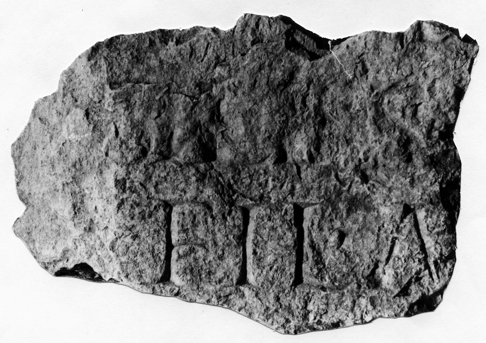

# EDH HD042789. Novae

**Країна.** Болгарія

**Провінція (код EDH).** MoI

**Місце знахідки (антична назва).** Novae

**Сучасна назва.** Svištov

**Деталі знахідки.** Lager, {principia, Fahnenheiligtum}

**Координати.** 43.612539136,25.394387840

**Рік знахідки.** 1975

**Датування (роки, від'ємні до н. е.).** 101 … 250

**Матеріал.** Gesteine

**Розміри (висота, ширина, глибина, см).** -16.0 × -18.0 × -18.0

## Текст (латинь, скорочення розкрито)

```
$ m]iles [leg(ionis) I Italicae?] / [---] fil(---) A[&
```

## Текст у вихідному записі

```
]ILES [ ] / [ ] FIL A[
```

## Література

ILBulg 322.
- ILNovae 096; Abb. 96.
- IGLN 155; pl. 44, 155. #

## Фото



Джерело https://edh.ub.uni-heidelberg.de/edh/inschrift/HD042789, ліцензія CC BY-SA 4.0. Оригінальний XML в архіві сирі_дані/edh_xml.zip
