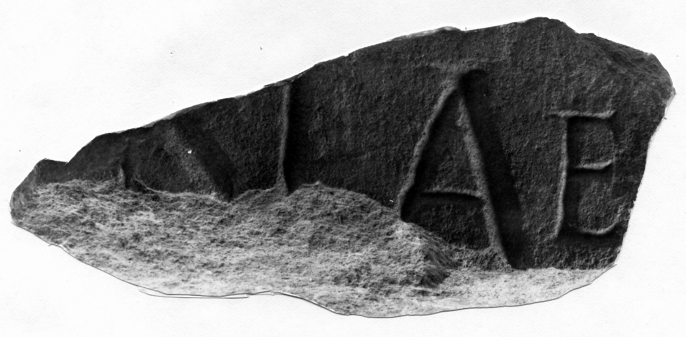

# EDH HD042791. Novae

**Країна.** Болгарія

**Провінція (код EDH).** MoI

**Місце знахідки (антична назва).** Novae

**Сучасна назва.** Svištov

**Деталі знахідки.** Lager, {Bischofsbasilika}

**Координати.** 43.612861502,25.393722651

**Рік знахідки.** 1978

**Датування (роки, від'ємні до н. е.).** 101 … 300

**Матеріал.** Gesteine

**Розміри (висота, ширина, глибина, см).** -13.0 × -22.5 × -8.0

## Текст (латинь, скорочення розкрито)

```
$]nae [&
```

## Текст у вихідному записі

```
]NAE [
```

## Література

ILNovae 098; Abb. 98.
- IGLN 157; pl. 44, 157. #

## Фото



Джерело https://edh.ub.uni-heidelberg.de/edh/inschrift/HD042791, ліцензія CC BY-SA 4.0. Оригінальний XML в архіві сирі_дані/edh_xml.zip
