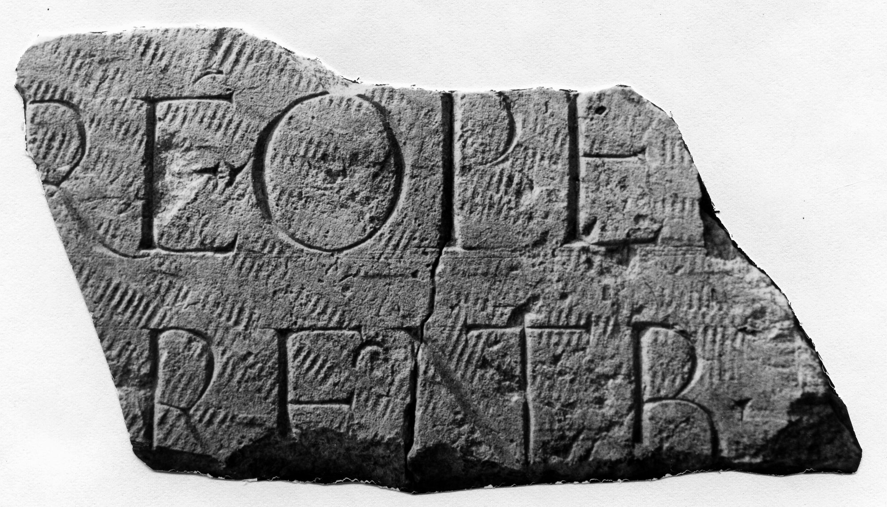

# EDH HD042793. Novae

**Країна.** Болгарія

**Провінція (код EDH).** MoI

**Місце знахідки (антична назва).** Novae

**Сучасна назва.** Svištov

**Деталі знахідки.** Lager, {valetudinarium}, über, spätantike Straße (sog. via inscriptionum), sekundär verwendet

**Координати.** 43.614500660,25.394251881

**Рік знахідки.** 1989

**Датування (роки, від'ємні до н. е.).** 51 … 150

**Матеріал.** Gesteine

**Тип пам'ятки.** Tafel?

**Розміри (висота, ширина, глибина, см).** -15.5 × -27.0 × -4.0

## Текст (латинь, скорочення розкрито)

```
$]RE OPE / [---]rentib(us)
```

## Текст у вихідному записі

```
]RE OPE / [ ]RENTIB
```

## Література

ILNovae 117; Abb. 117.
- IGLN 159; pl. 44, 159. #

## Фото



Джерело https://edh.ub.uni-heidelberg.de/edh/inschrift/HD042793, ліцензія CC BY-SA 4.0. Оригінальний XML в архіві сирі_дані/edh_xml.zip
