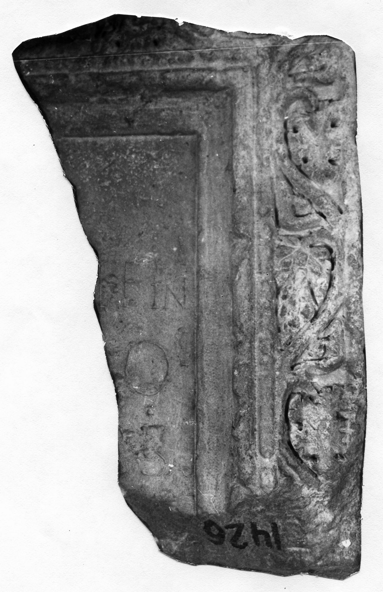

# EDH HD042816. Novae, bei

**Країна.** Болгарія

**Провінція (код EDH).** MoI

**Місце знахідки (антична назва).** Novae, bei

**Сучасна назва.** Svištov

**Деталі знахідки.** {Carevec}, bei

**Координати.** 43.5859198,25.3651251

**Зберігання.** Svištov, Ist. Muz.

**Датування (роки, від'ємні до н. е.).** 151 … 300

**Матеріал.** Gesteine

**Тип пам'ятки.** Stele

**Розміри (висота, ширина, глибина, см).** -80.0 × -45.0 × 29.0

## Текст (латинь, скорочення розкрито)

```
$?] / [---]T FINI / [---]LO / [---]RSAE / [&
```

## Текст у вихідному записі

```
] / [ ]T FINI / [ ]LO / [ ]RSAE / [
```

## Література

ILBulg 269bis.
- ILNovae 102; Abb. 102.
- IGLN 164; pl. 45, 164 (Foto u. Zeichnung). #

## Фото



Джерело https://edh.ub.uni-heidelberg.de/edh/inschrift/HD042816, ліцензія CC BY-SA 4.0. Оригінальний XML в архіві сирі_дані/edh_xml.zip
