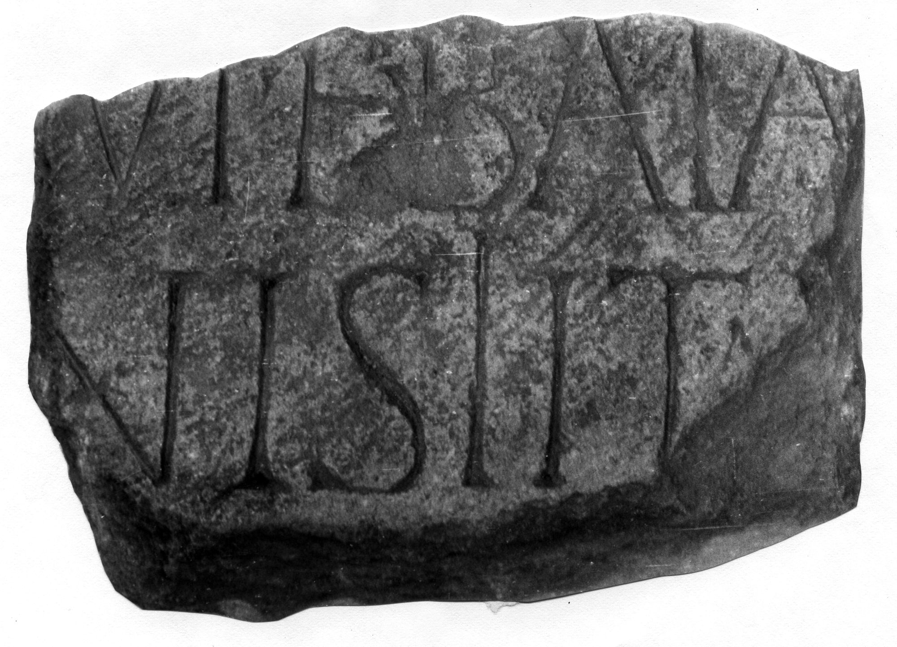

# EDH HD042819. Novae

**Країна.** Болгарія

**Провінція (код EDH).** MoI

**Місце знахідки (антична назва).** Novae

**Сучасна назва.** Svištov

**Деталі знахідки.** Lager, {Bischofsbasilika}

**Координати.** 43.612861502,25.393722651

**Рік знахідки.** 1980

**Датування (роки, від'ємні до н. е.).** 151 … 250

**Матеріал.** Gesteine

**Тип пам'ятки.** Tafel?

**Розміри (висота, ширина, глибина, см).** -26.0 × -16.0 × -14.0

## Текст (латинь, скорочення розкрито)

```
$]VIEBAIA[---] / [--- legio]nis I Ita[l(icae) &
```

## Текст у вихідному записі

```
]VIEBAIA[ ] / [ ]NIS I ITA[
```

## Література

ILNovae 103; Abb. 103; Abb. 103 b (Zeichnung).
- IGLN 165; pl. 45, 165 (Foto u. Zeichnung). #

## Фото



Джерело https://edh.ub.uni-heidelberg.de/edh/inschrift/HD042819, ліцензія CC BY-SA 4.0. Оригінальний XML в архіві сирі_дані/edh_xml.zip
