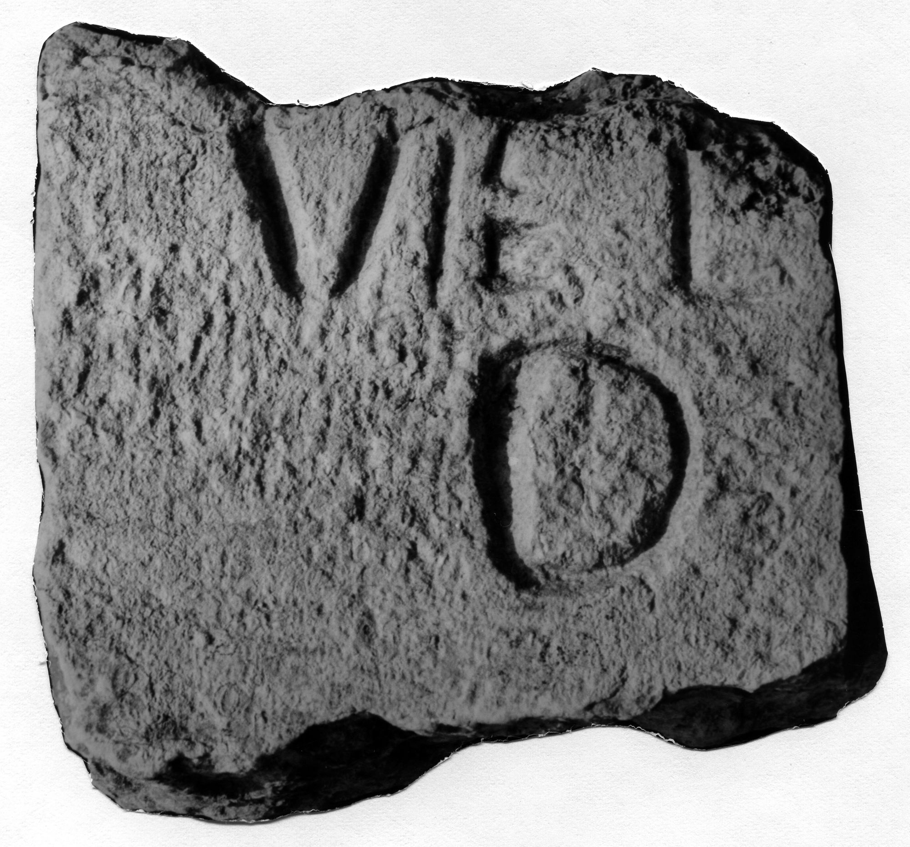

# EDH HD042820. Novae

**Країна.** Болгарія

**Провінція (код EDH).** MoI

**Місце знахідки (антична назва).** Novae

**Сучасна назва.** Svištov

**Деталі знахідки.** {spätantike Erweiterung}

**Координати.** 43.612170160,25.398518441

**Тип пам'ятки.** Tafel

**Розміри (висота, ширина, глибина, см).** -13.0 × -13.0 × 6.5

## Текст (латинь, скорочення розкрито)

```
$]VIE I[---] / [---]D [&
```

## Текст у вихідному записі

```
]VIE I[ ] / [ ]D [
```

## Коментар

Datierung unklar.

## Література

ILNovae 104; Abb. 104.
- IGLN 166; pl. 46, 166. #

## Фото



Джерело https://edh.ub.uni-heidelberg.de/edh/inschrift/HD042820, ліцензія CC BY-SA 4.0. Оригінальний XML в архіві сирі_дані/edh_xml.zip
