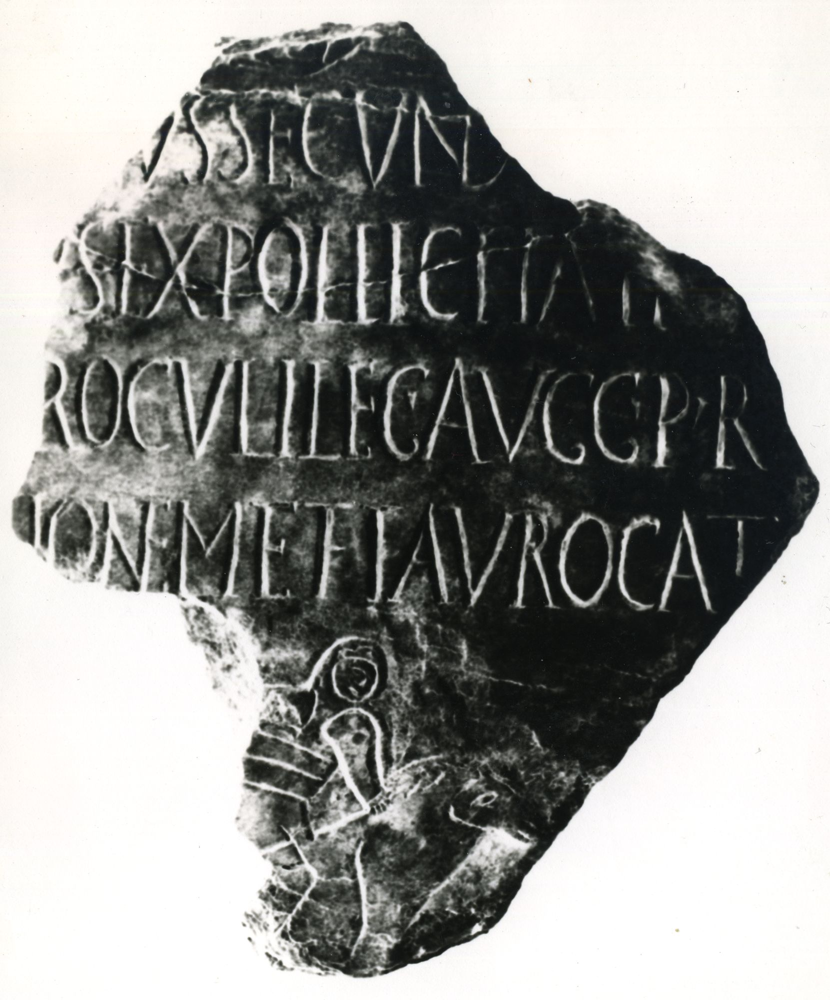
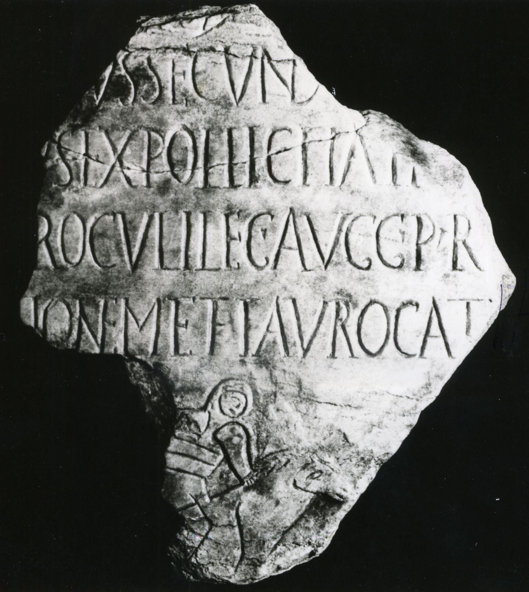

# EDH HD073051. Deultum

**Країна.** Болгарія

**Провінція (код EDH).** Thr

**Місце знахідки (антична назва).** Deultum

**Сучасна назва.** Sredec

**Деталі знахідки.** {Debelt}

**Координати.** 42.388350083,27.280812263

## Текст (латинь, скорочення розкрито)

```
[---]ius Secund[---] / [---]us ex pollicitati[one sua iussu] / [Q(uinti) Egnati P]roculi leg(ati) Aug(usti) pr(o) [pr(aetore) ---] / [vena]tionem et taurocath[apsia dedit?]
```

## Текст у вихідному записі

```
[ ]IVS SECVND[ ] / [ ]VS EX POLLICITATI[ ] / [ ]ROCVLI LEG AVG PR [ ] / [ ]TIONEM ET TAVROCATH[ ]
```

## Література

AE 2009, 1232. #

## Фото





Джерело https://edh.ub.uni-heidelberg.de/edh/inschrift/HD073051, ліцензія CC BY-SA 4.0. Оригінальний XML в архіві сирі_дані/edh_xml.zip
