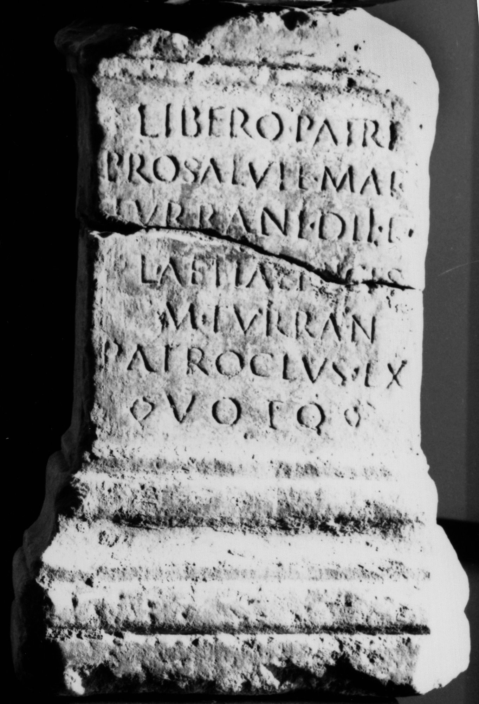

# EDH HD000598. Tibiscum

**Країна.** Румунія

**Провінція (код EDH).** Dac

**Місце знахідки (антична назва).** Tibiscum

**Сучасна назва.** Caransebeş

**Деталі знахідки.** Potoc, {Strada Traian Doda} 367, sekundär verwendet

**Координати.** 45.4132871,22.222866100

**Зберігання.** Caransebeş, Muz. Jud. Etnogr.

**Датування (роки, від'ємні до н. е.).** 107 … 200

**Тип пам'ятки.** Altar

**Розміри (висота, ширина, глибина, см).** -44.0 × -33.0 × -15.0

## Текст (латинь, скорочення розкрито)

```
Libero Patri / pro salute Mar(ci) / Turrani Dii et / [F]l(aviae)(?) Aeliae Nices / M(arcus) Turran(ius) / Patroclus ex / voto
```

## Текст у вихідному записі

```
LIBERO PATRI / PRO SALVTE MAR / TVRRANI DII ET / [ ]L AELIAE NICES / M TVRRAN / PATROCLVS EX / VOTO
```

## Коментар

(B): CIL, IDR, Piso: geringfügige Leseabweichungen.

## Література

AE 1983, 0799a.
- I. Piso, ActaMusNapoca 20, 1983, 109, Nr. 6; fig. 5. (B) - AE 1983.
- IDR 3, 1, 141; fig. 110 (Foto u. Zeichnung). (B)
- CIL 03, 01548. (B)
- ILD 204. #

## Фото



Джерело https://edh.ub.uni-heidelberg.de/edh/inschrift/HD000598, ліцензія CC BY-SA 4.0. Оригінальний XML в архіві сирі_дані/edh_xml.zip
