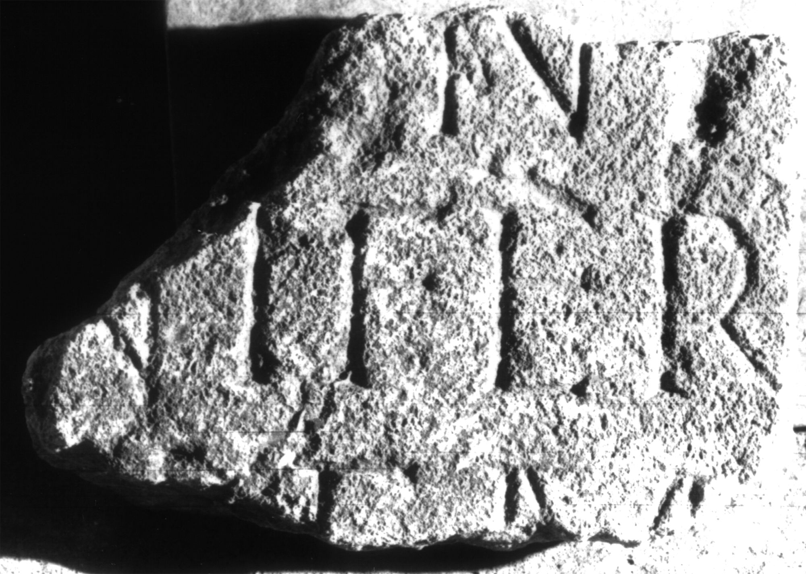

# EDH HD000652. Apulum

**Країна.** Румунія

**Провінція (код EDH).** Dac

**Місце знахідки (антична назва).** Apulum

**Сучасна назва.** Alba Iulia

**Координати.** 46.0669444,23.569999999

**Зберігання.** Alba Iulia, Muz. Unirii

**Датування (роки, від'ємні до н. е.).** 131 … 275

**Матеріал.** Sandstein

**Тип пам'ятки.** Tafel

**Розміри (висота, ширина, глибина, см).** -16.0 × -23.0 × 6.5

**Стан збереження.** F

## Текст (латинь, скорочення розкрито)

```
$]N[---] / [--- sig]nifer / [leg(ionis) XIII] gem(inae) / [&
```

## Текст у вихідному записі

```
]N[ ] / [ ]NIFER / [ ] GEM / [
```

## Література

AE 1983, 0814.
- C.L. Băluţă - I.I. Russu, Apulum 20, 1982, 131, Nr. 15; fig. 15 (Foto u. Zeichnung). - AE 1983.
- IDR 3, 5, 669; Foto u. Zeichnung. #

## Фото



Джерело https://edh.ub.uni-heidelberg.de/edh/inschrift/HD000652, ліцензія CC BY-SA 4.0. Оригінальний XML в архіві сирі_дані/edh_xml.zip
