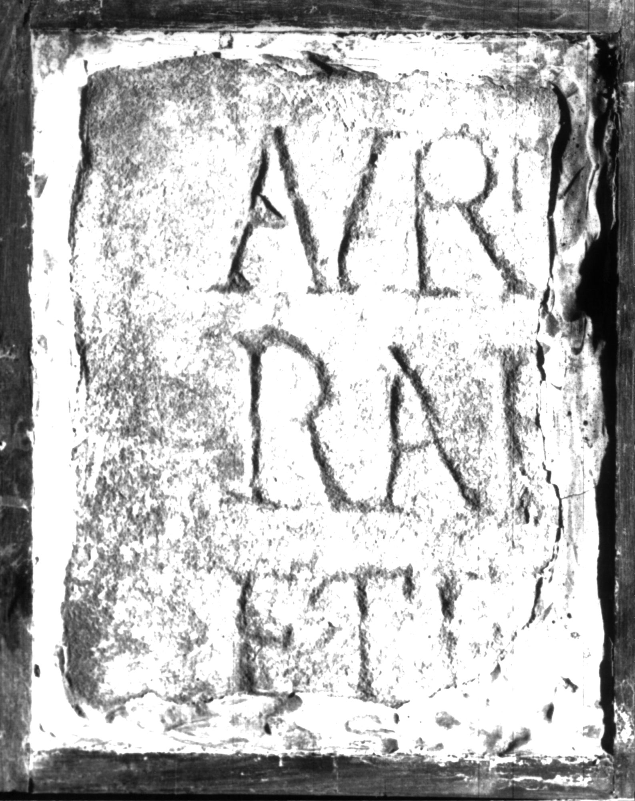

# EDH HD000655. Apulum

**Країна.** Румунія

**Провінція (код EDH).** Dac

**Місце знахідки (антична назва).** Apulum

**Сучасна назва.** Alba Iulia

**Деталі знахідки.** Dealul Furcilor, Kutyamál, römische Nekropole

**Координати.** 46.0541509,23.567690800

**Рік знахідки.** 1907

**Зберігання.** Alba Iulia, Muz. Unirii

**Датування (роки, від'ємні до н. е.).** 201 … 270

**Матеріал.** Kalkstein

**Тип пам'ятки.** Tafel

**Розміри (висота, ширина, глибина, см).** -23.0 × -20.0 × 2.5

## Текст (латинь, скорочення розкрито)

```
$] / Q[---] / Aur(elius) T(?)[---]us tesse/rar[ius coniu]x eius / et E(?)I(?)[---] filius / [matri?] pien[tissi]m(a)e / [---]M[---] / [& // $]I(?)I(?)us / [--- bene mere]ntibus / [------](?) // $]SM[---] / [---]fil[&
```

## Текст у вихідному записі

```
] / Q[ ] / AVR T[ ]VS TESSE / RAR[ ]X EIVS / ET EI[ ] FILIVS / [ ] PIEN[ ]ME / [ ]M[ ] / [ / / ]IIVS / [ ]NTIBVS / [ ] / / ]SM[ ] / [ ]FIL[
```

## Коментар

5 nicht aneinanderpassende Fragmente erhalten. Maße beziehen sich auf Fragment a; Maße Fragment b: (31) x (29) x 3 cm; c: (13) x (10) x 3 cm; d: (20) x (23) x 2,5 cm; e: (12) x (7) x 3,5 cm. Băluţă - Russu; AE 1983: nur Fragment b. Z. 4 (Anfang): statt E auch F möglich. (B): AE 1983: Z. 5: m(erenti); Piso; AE 1987: Z. 4: et E[---]; Z. 6: nicht geles

## Література

AE 1983, 0813. (B)
- C.L. Băluţă - I.I. Russu, Apulum 20, 1982, 130-131, Nr. 14; fig. 14 (Foto u. Zeichnung). - AE 1983.
- AE 1987, 0832. (B)
- I. Piso, ActaMusNapoca 22/23, 1985/86, 489-490, Nr. 5; fig. 5 (Fotos u. Zeichnung). (B) - AE 1987.
- C. Ciongradi, Grabmonument und sozialer Status in Oberdakien (Cluj-Napoca 2007) 275, Nr. T/A 12; Taf. 127 (Zeichnung).
- IDR 3, 5, 503; Foto u. Zeichnung. #

## Фото



Джерело https://edh.ub.uni-heidelberg.de/edh/inschrift/HD000655, ліцензія CC BY-SA 4.0. Оригінальний XML в архіві сирі_дані/edh_xml.zip
