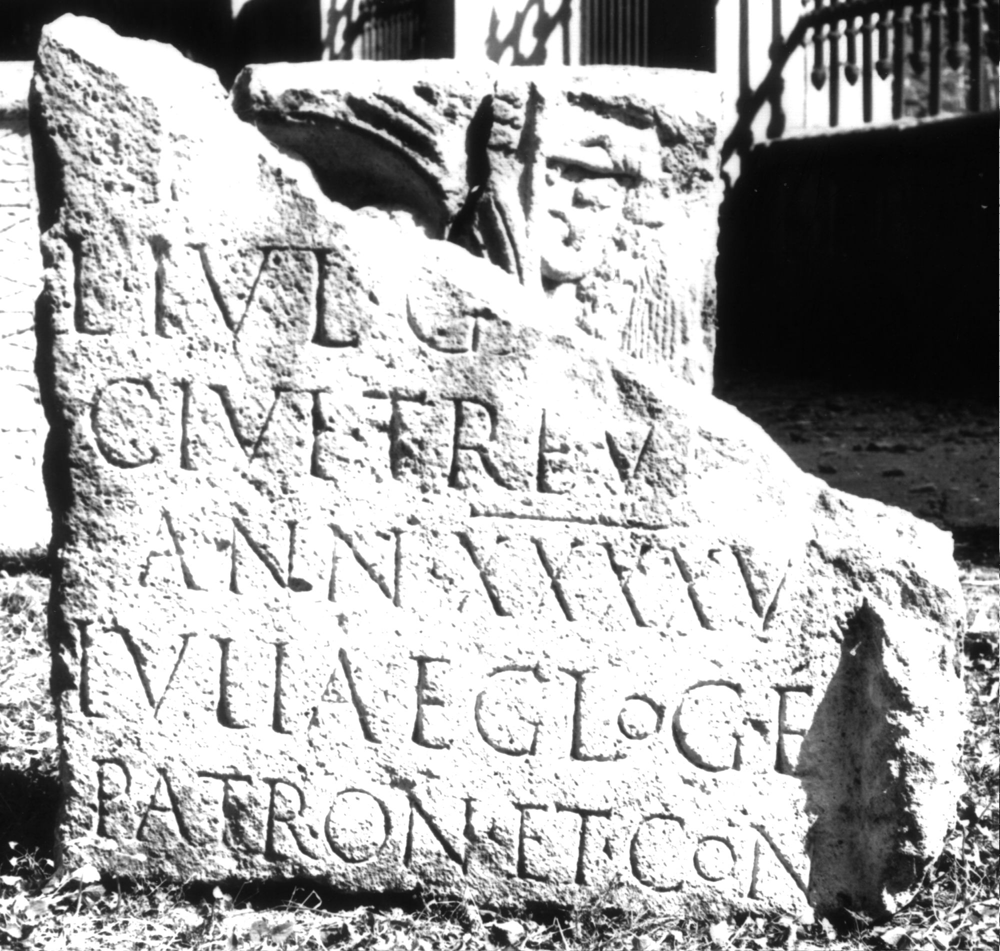

# EDH HD000658. Apulum

**Країна.** Румунія

**Провінція (код EDH).** Dac

**Місце знахідки (антична назва).** Apulum

**Сучасна назва.** Alba Iulia

**Деталі знахідки.** Partoş, {Strada Dacilor}

**Координати.** 46.043160136,23.557809637

**Рік знахідки.** 1981

**Зберігання.** Alba Iulia, Muz. Unirii

**Датування (роки, від'ємні до н. е.).** 131 … 200

**Матеріал.** Kalkstein

**Тип пам'ятки.** Stele

**Розміри (висота, ширина, глибина, см).** -88.0 × -83.0 × 20.0

**Стан збереження.** F

## Текст (латинь, скорочення розкрито)

```
D(is) [M(anibus)] / L(ucio) Iul(io) Ga[---] / civi Treve[ro] / ann(orum) XXXXV / Iulia Egloge / patron(o) et con(iugi) / [&
```

## Текст у вихідному записі

```
D [ ] / L IVL GA[ ] / CIVI TREVE[ ] / ANN XXXXV / IVLIA EGLOGE / PATRON ET CON / [
```

## Коментар

Rechts des Inschriftfeldes noch Rest einer Halbsäule erhalten. (B): Băluţă - Russu: Z. 3: Trev[i?ro]; AE 1983: Z. 3: Trev[ero].

## Література

AE 1983, 0812. (B)
- C.L. Băluţă - I.I. Russu, Apulum 20, 1982, 128-130, Nr. 12; fig 12 (Foto u. Zeichnung). (B) - AE 1983.
- IDR 3, 5, 543; Foto u. Zeichnung.
- C. Ciongradi, Grabmonument und sozialer Status in Oberdakien (Cluj-Napoca 2007) 173, Nr. S/A 46; Taf. 49. #

## Фото



Джерело https://edh.ub.uni-heidelberg.de/edh/inschrift/HD000658, ліцензія CC BY-SA 4.0. Оригінальний XML в архіві сирі_дані/edh_xml.zip
