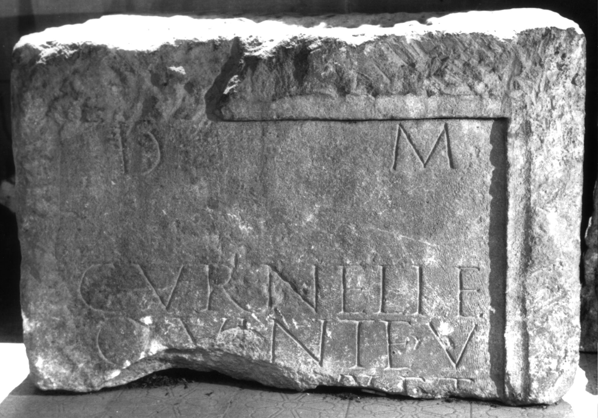

# EDH HD000664. Apulum

**Країна.** Румунія

**Провінція (код EDH).** Dac

**Місце знахідки (антична назва).** Apulum

**Сучасна назва.** Alba Iulia

**Деталі знахідки.** Festung, {Strada Mitropolit Andrei Şaguna}, sekundär verwendet

**Координати.** 46.069448934,23.571376456

**Рік знахідки.** 1964

**Зберігання.** Alba Iulia, Muz. Unirii

**Датування (роки, від'ємні до н. е.).** 131 … 170

**Матеріал.** Gesteine

**Тип пам'ятки.** Altar?

**Розміри (висота, ширина, глибина, см).** -62.0 × -92.0 × 70.0

## Текст (латинь, скорочення розкрито)

```
D(is) M(anibus) / Curneli(a)e(!) / Quint(a)e v/[ix(it) ann(os)] XX et / [&
```

## Текст у вихідному записі

```
D M / CVRNELIE / QVINTE V / [ ] XX ET / [
```

## Коментар

Mittelteil eines Altars oder einer Statuenbasis; auf der Oberseite ein Dübelloch Z. 3: Băluţă - Russu; AE 1983; IDR; Ciongradi: v(ixit). (B): Ciongradi: Z. 3/4: Zeilenfall fehlt.

## Література

AE 1983, 0810.
- C.L. Băluţă - I.I. Russu, Apulum 20, 1982, 126-127, Nr. 10; fig. 10 (Foto u. Zeichnung). - AE 1983.
- IDR 3, 5, 520; Foto u. Zeichnung.
- C. Ciongradi, Grabmonument und sozialer Status in Oberdakien (Cluj-Napoca 2007) 234, Nr. Sc/A 13; Taf. 89. (B) #

## Фото



Джерело https://edh.ub.uni-heidelberg.de/edh/inschrift/HD000664, ліцензія CC BY-SA 4.0. Оригінальний XML в архіві сирі_дані/edh_xml.zip
