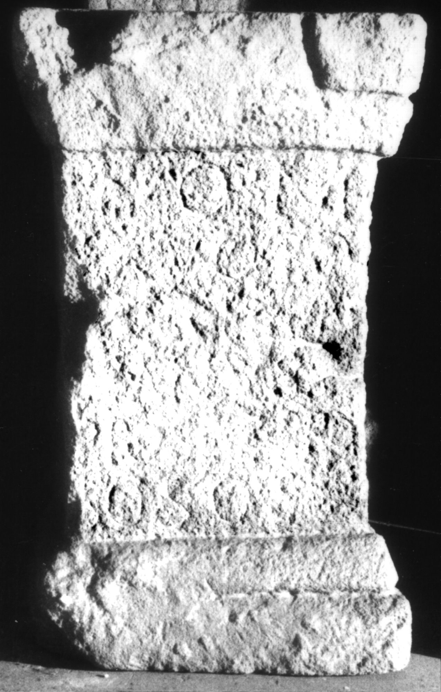
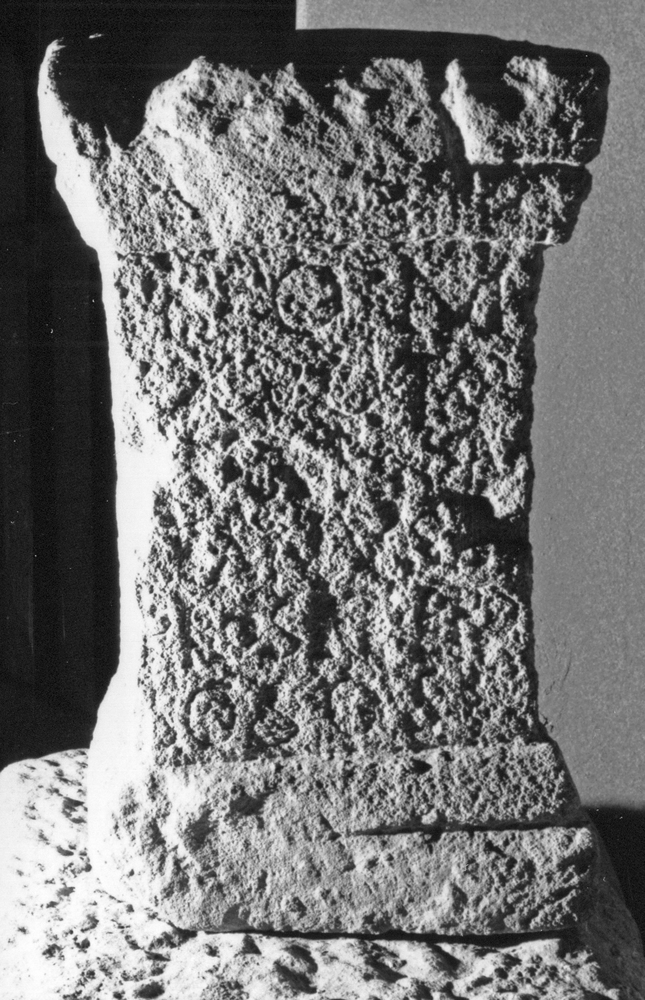

# EDH HD000667. Apulum

**Країна.** Румунія

**Провінція (код EDH).** Dac

**Місце знахідки (антична назва).** Apulum

**Сучасна назва.** Alba Iulia

**Деталі знахідки.** Partoş, {orthodoxe Kirche}, bei

**Координати.** 46.041502627,23.562686099

**Рік знахідки.** 1963

**Зберігання.** Alba Iulia, Muz. Unirii

**Датування (роки, від'ємні до н. е.).** 151 … 270

**Матеріал.** Kalkstein

**Тип пам'ятки.** Statuenbasis

**Розміри (висота, ширина, глибина, см).** 54.0 × 33.0 × 21.0

## Текст (латинь, скорочення розкрито)

```
I(ovi) O(ptimo) M(aximo) / ex voto / [---]E Mu/cianus / pro se et pro / SOSOSE(?)
```

## Текст у вихідному записі

```
I O M / EX VOTO / [ ]E MV / CIANVS / PRO SE ET PRO / SOSOSE
```

## Коментар

Oberfläche stark verrieben. Z. 6: IDR III 5: möglicherweise SOSOS anstelle von SVIS oder SVOS. (B): Băluţă - Russu; AE 1983: Abweichungen in Lesung / Ergänzung.

## Література

AE 1983, 0809. (B)
- C.L. Băluţă - I.I. Russu, Apulum 20, 1982, 126, Nr. 9; fig. 9 (Foto u. Zeichnung). (B) - AE 1983.
- IDR 3, 5, 156; Foto u. Zeichnung. #

## Фото





Джерело https://edh.ub.uni-heidelberg.de/edh/inschrift/HD000667, ліцензія CC BY-SA 4.0. Оригінальний XML в архіві сирі_дані/edh_xml.zip
