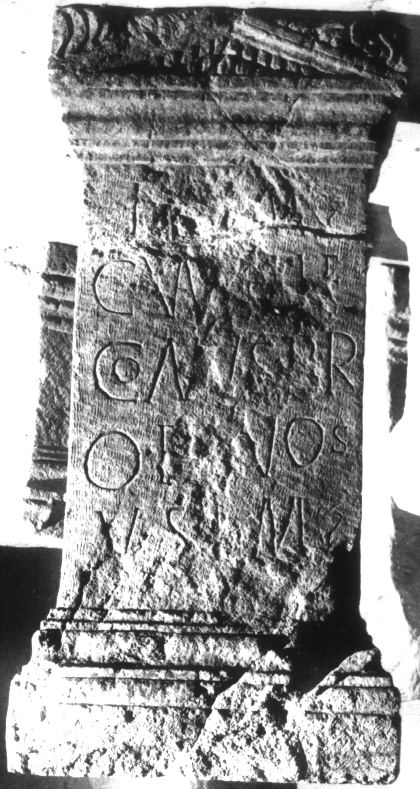

# EDH HD000670. Apulum

**Країна.** Румунія

**Провінція (код EDH).** Dac

**Місце знахідки (антична назва).** Apulum

**Сучасна назва.** Alba Iulia

**Деталі знахідки.** Partoş, {Strada Dacilor} 8

**Координати.** 46.044143139,23.559968816

**Зберігання.** Alba Iulia, Muz. Unirii

**Датування (роки, від'ємні до н. е.).** 101 … 200

**Матеріал.** Kalkstein

**Тип пам'ятки.** Statuenbasis

**Розміри (висота, ширина, глибина, см).** 105.0 × 49.0 × 33.0

**Стан збереження.** FF

## Текст (латинь, скорочення розкрито)

```
I(ovi) [O(ptimo)] M(aximo) / C(aius) Va[l(erius)?] [Tel?]e/gonus pr/o <se> et [s]uos(!) / v(otum) s(olvit) l(ibens) m(erito)
```

## Текст у вихідному записі

```
I [ ] M / C VA[ ] [ ]E / GONVS PR / O ET [ ]VOS / V S L M
```

## Коментар

(B): Z. 3/4: Băluţă - Russu; AE 1983: pr/o B( ) VO(?) S; Alföldy: vielleicht pr/o b[o]no s(uo); Z. 1 u. 5 (Ende): hederae.

## Література

AE 1983, 0808. (B)
- C.L. Băluţă - I.I. Russu, Apulum 20, 1982, 125-126, Nr. 8; fig. 8 (Foto u. Zeichnung). - AE 1983. (B)
- IDR 3, 5, 170; Foto u. Zeichnung. #

## Фото



Джерело https://edh.ub.uni-heidelberg.de/edh/inschrift/HD000670, ліцензія CC BY-SA 4.0. Оригінальний XML в архіві сирі_дані/edh_xml.zip
