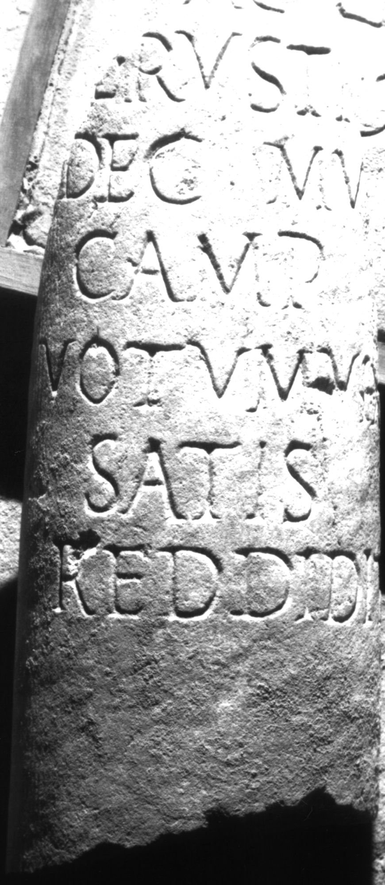
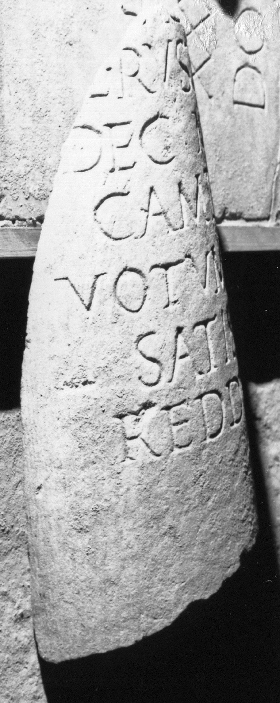

# EDH HD000673. Apulum

**Країна.** Румунія

**Провінція (код EDH).** Dac

**Місце знахідки (антична назва).** Apulum

**Сучасна назва.** Alba Iulia

**Деталі знахідки.** {Platoul Romanilor}

**Координати.** 46.0724587,23.556527400

**Зберігання.** Alba Iulia, Muz. Unirii

**Датування (роки, від'ємні до н. е.).** 193 … 275

**Матеріал.** Marmor

**Тип пам'ятки.** Architekturteil

**Розміри (висота, ширина, глибина, см).** -45.0 × 19.0

**Стан збереження.** F

## Текст (латинь, скорочення розкрито)

```
[------] / [s]ac(rum) / [P(ublius) Ae]l(ius) Rustic[us?] / dec(urio) mu[ni]/c(ipii) Amp(elensium?) / votum vix / satis / reddidit
```

## Текст у вихідному записі

```
[ ] / [ ]AC / [ ]L RVSTIC[ ] / DEC MV[ ] / C AMP / VOTVM VIX / SATIS / REDDIDIT
```

## Коментар

Ergänzung mu[ni]c(ipi) Amp(elensium): Vgl. CIL III 1293: IIviri et ordo Amp(elensium). Rustic[---]: z.B. Rustic[us] oder Rustic[anus]. Säule.

## Література

AE 1983, 0806.
- C.L. Băluţă - I.I. Russu, Apulum 20, 1982, 120-123, Nr. 5; fig. 5 (Foto u. Zeichnung). - AE 1983.
- IDR 3, 5, 390; Foto u. Zeichnung. #

## Фото





Джерело https://edh.ub.uni-heidelberg.de/edh/inschrift/HD000673, ліцензія CC BY-SA 4.0. Оригінальний XML в архіві сирі_дані/edh_xml.zip
