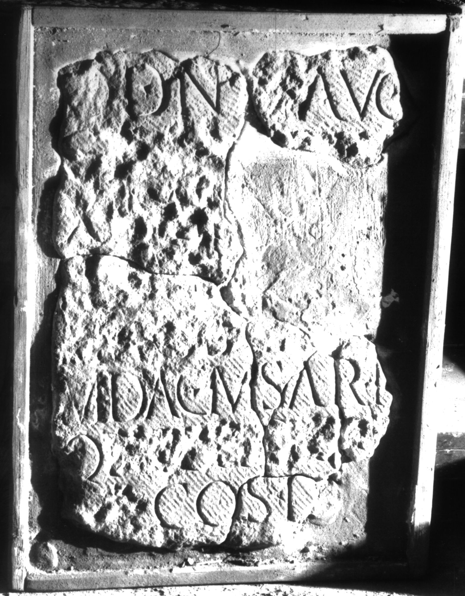

# EDH HD000688. Apulum

**Країна.** Румунія

**Провінція (код EDH).** Dac

**Місце знахідки (антична назва).** Apulum

**Сучасна назва.** Alba Iulia

**Деталі знахідки.** Praetorium des Statthalters?

**Координати.** 46.076691,23.580099

**Рік знахідки.** 1969

**Зберігання.** Alba Iulia, Muz. Unirii

**Датування (роки, від'ємні до н. е.).** 237 … 238

**Матеріал.** Kalkstein

**Тип пам'ятки.** Tafel

**Розміри (висота, ширина, глибина, см).** -56.0 × -39.0 × 5.0

## Текст (латинь, скорочення розкрито)

```
$] / [pro salute ---] / [[d]]d(ominorum) [[n]]n(ostrorum) Aug[[[g(ustorum)]]] / [[C(ai) [I]ul(i) V[e]ri M[a]]]/[[ximin[i Aug(usti) et]]] / [[C(ai) Iul(i) V[eri Maxi]]]/[[m(i) nob(ilissimi) Ca[es(aris) Ger(manicorum)]]] / m(aximorum) Dac(icorum) m(aximorum) Sar(maticorum) m[ax(imorum)?] / Q(uintus)(?) [[Iulius Licin[ian]]]/[[us?]] co(n)s(ularis) D[ac(iarum) III]
```

## Текст у вихідному записі

```
] / [ ] / [[D]]D [[N]]N AVG[[[ ]]] / [[C [ ]VL V[ ]RI M[ ]]] / [[XIMIN[ ]]] / [[C IVL V[ ]]] / [[M NOB CA[ ]]] / M DAC M SAR M[ ] / Q [[IVLIVS LICIN[ ]]] / [[VS]] COS D[ ]
```

## Коментар

Tafel aus 6 Fragmenten zusammengesetzt. Rechter Teil nicht erhalten. (B): Băluţă - Russu: Z. 3-76: C(ai) I[[ul(i) Ve]]ri M[[a]]/ximin[[i et C(ai) Iul(i) / Veri Maximi / n]]ob(ilissimi) ca[[es(aris) Ger(amini)]] / m(aximi) Dac(ici) M(aximi) Sar(matici) M(aximi).

## Література

AE 1984, 0737.
- I. Piso, Tituli 4 (Roma 1982) 489-491, Nr. 1; tav. 2,1; fig. 1 (Zeichnung). - AE 1984.
- AE 1983, 0802.
- C.L. Băluţă - I.I. Russu, Apulum 20, 1982, 119-120, Nr. 3; fig. 3 (Foto u. Zeichnung). (B) - AE 1983.
- I. Piso, ZPE 49, 1982, 230-231, Nr. 5.
- IDR 3, 5, 429; Foto u. Zeichnung.
- I. Piso, Fasti provinciae Daciae 1. Die senatorischen Amtsträger (Bonn 1993) 201-203, Nr. 45. #

## Фото



Джерело https://edh.ub.uni-heidelberg.de/edh/inschrift/HD000688, ліцензія CC BY-SA 4.0. Оригінальний XML в архіві сирі_дані/edh_xml.zip
