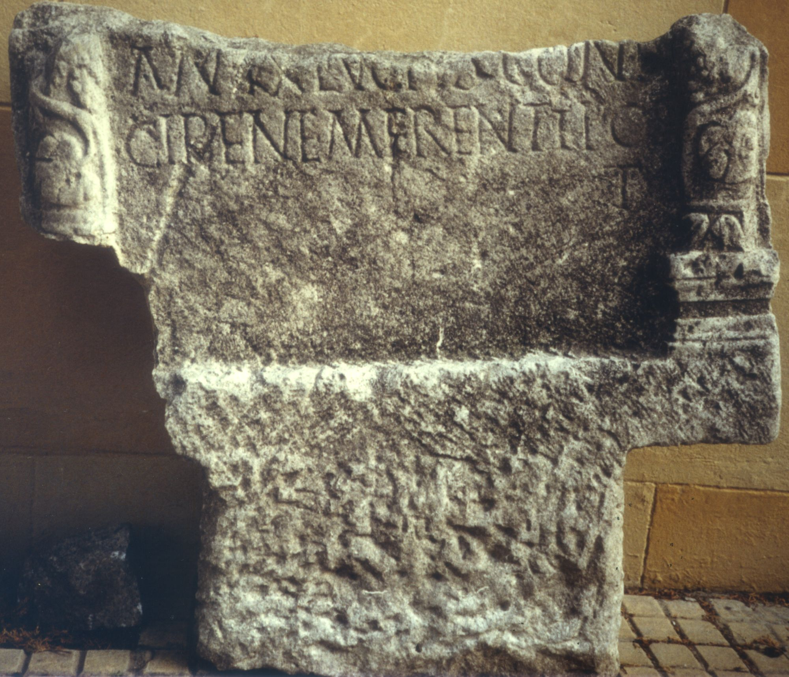
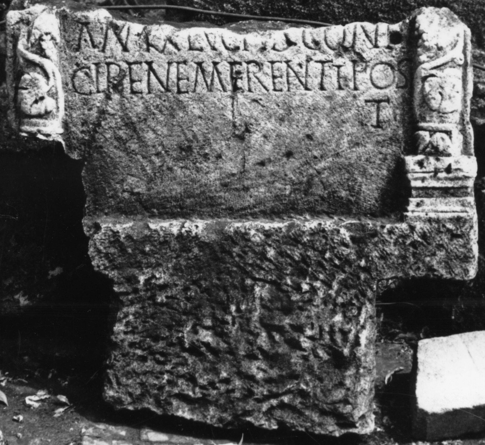
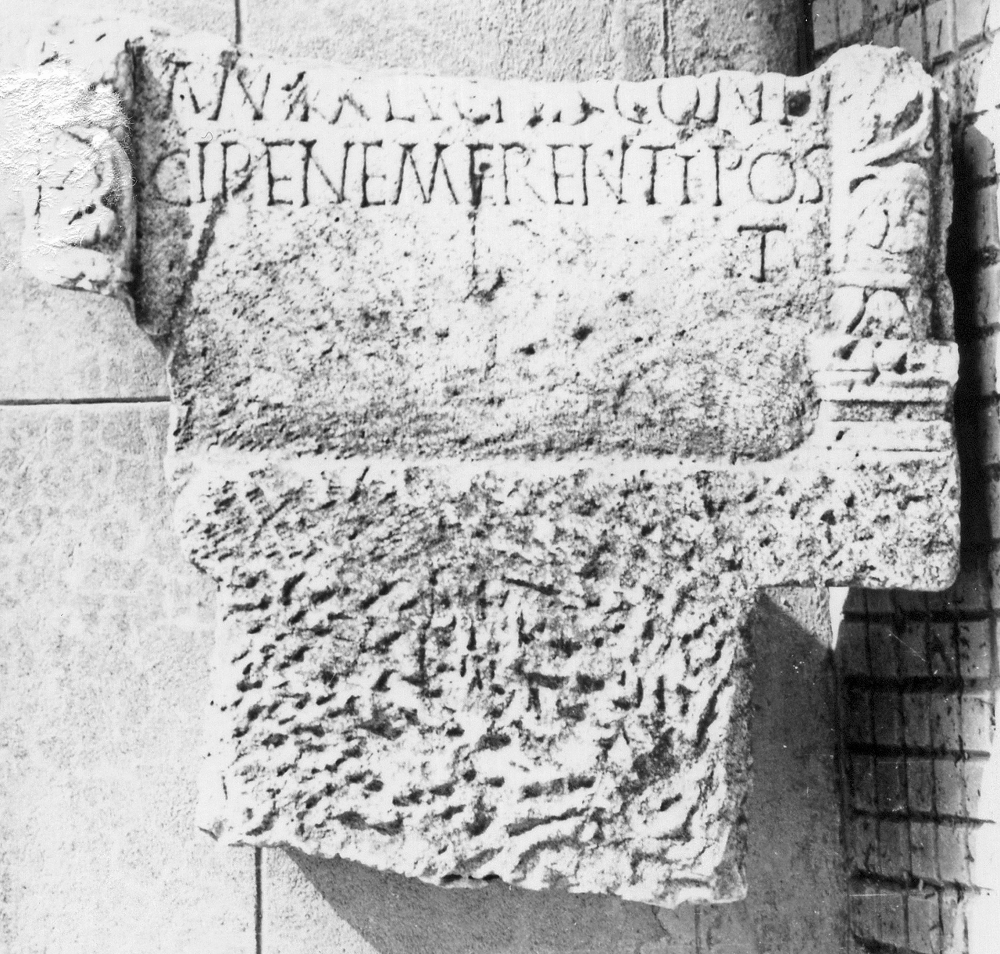

# EDH HD000748. Apulum

**Країна.** Румунія

**Провінція (код EDH).** Dac

**Місце знахідки (антична назва).** Apulum

**Сучасна назва.** Alba Iulia

**Деталі знахідки.** {Partoş}

**Координати.** 46.0463184,23.566650100

**Рік знахідки.** 1979

**Зберігання.** Alba Iulia, Muz. Unirii

**Датування (роки, від'ємні до н. е.).** 151 … 270

**Матеріал.** Kalkstein

**Тип пам'ятки.** Stele

**Розміри (висота, ширина, глибина, см).** -77.0 × -88.0 × -15.0

**Стан збереження.** F

## Текст (латинь, скорочення розкрито)

```
$] / [--- vix(it)] / an(nos) LX Lucius coniu/gi bene merenti pos(ui)/t
```

## Текст у вихідному записі

```
] / [ ] / AN LX LVCIVS CONIV / GI BENE MERENTI POS / T
```

## Коментар

Unterer Teil einer Stele. Inschriftfeld von Halbsäulen flankiert. Z. 3: IDR III 5: möglicherweise auch t(estamento). (B): AE 1983: Z. 2: pos/[ui]t.

## Література

AE 1983, 0820. (B)
- C.L. Băluţă, Apulum 21, 1983, 95-96, Nr. 13; fig. 13 (Foto u. Zeichnung). - AE 1983.
- IDR 3, 5, 551; Foto.
- C. Ciongradi, Grabmonument und sozialer Status in Oberdakien (Cluj-Napoca 2007) 173, Nr. S/A 44; Taf. 49 (Zeichnung). #

## Фото







Джерело https://edh.ub.uni-heidelberg.de/edh/inschrift/HD000748, ліцензія CC BY-SA 4.0. Оригінальний XML в архіві сирі_дані/edh_xml.zip
