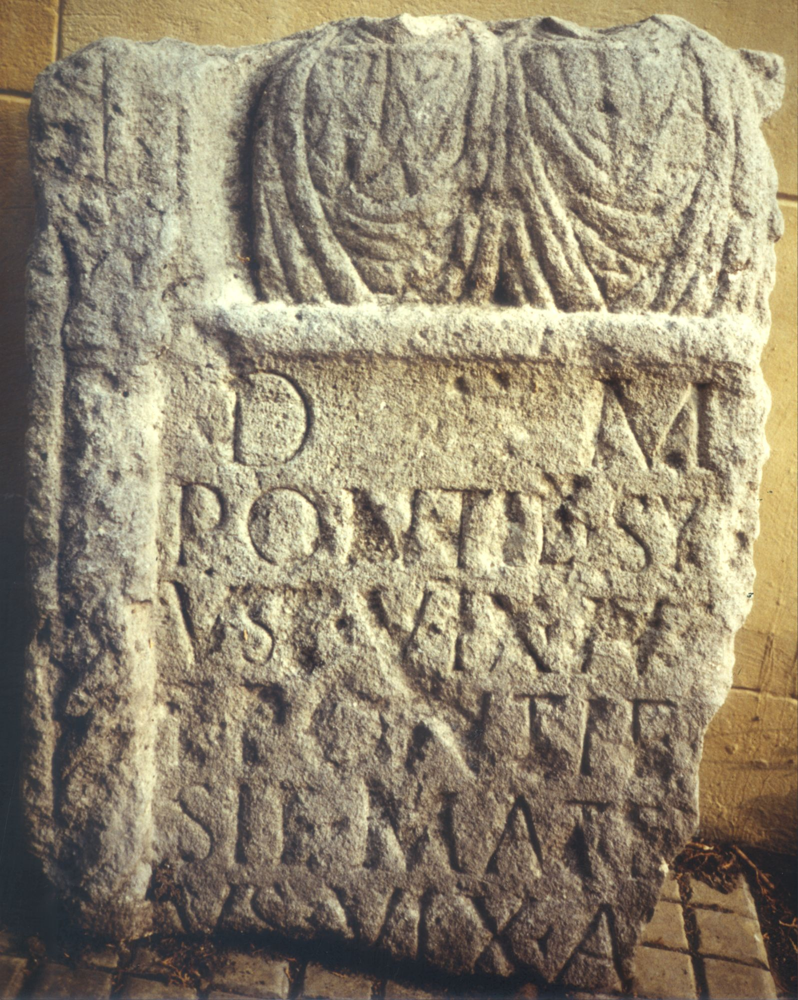
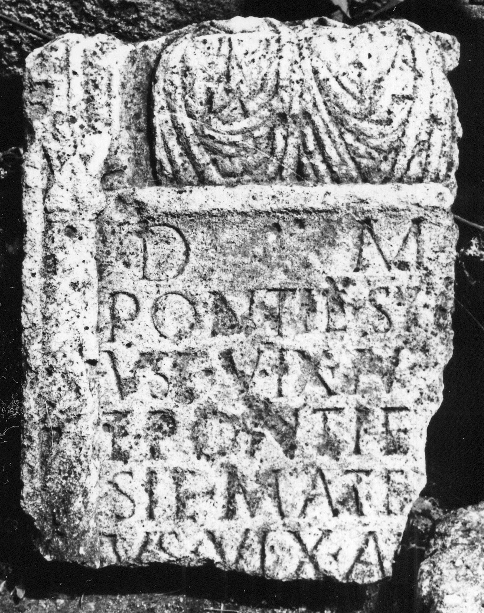

# EDH HD000751. Apulum

**Країна.** Румунія

**Провінція (код EDH).** Dac

**Місце знахідки (антична назва).** Apulum

**Сучасна назва.** Alba Iulia

**Деталі знахідки.** {Partoş}

**Координати.** 46.0463184,23.566650100

**Рік знахідки.** 1979

**Зберігання.** Alba Iulia, Muz. Unirii

**Датування (роки, від'ємні до н. е.).** 151 … 270

**Матеріал.** Kalkstein

**Тип пам'ятки.** Stele

**Розміри (висота, ширина, глибина, см).** -83.0 × -70.0 × 24.0

**Стан збереження.** F

## Текст (латинь, скорочення розкрито)

```
D(is) M(anibus) / Ponti(a)e Sy[-]/us(a)e vix(it) an(nos) V(?) / et Ponti(a)e A/si(a)e mat(ri) ei/us vix(it) an(nos) / [&
```

## Текст у вихідному записі

```
D M / PONTIE SY[ ] / VSE VIX AN V / ET PONTIE A / SIE MAT EI / VS VIX AN / [
```

## Коментар

Oberhalb der Inschrift Reste zweier Büsten erhalten; Inschriftfeld ehemals von Halbsäulen flankiert (nur links erhalten). Z. 3 (Ende): statt V auch X möglich. (B): Băluţă; AE 1983: Leseabweichungen.

## Література

AE 1983, 0819. (B)
- C.L. Băluţă, Apulum 21, 1983, 95, Nr. 12; fig. 12 (Foto u. Zeichnung). (B) - AE 1983.
- IDR 3, 5, 563; Foto u. Zeichnung.
- C. Ciongradi, Grabmonument und sozialer Status in Oberdakien (Cluj-Napoca 2007) 167, Nr. S/A 27; Taf. 46. #

## Фото





Джерело https://edh.ub.uni-heidelberg.de/edh/inschrift/HD000751, ліцензія CC BY-SA 4.0. Оригінальний XML в архіві сирі_дані/edh_xml.zip
