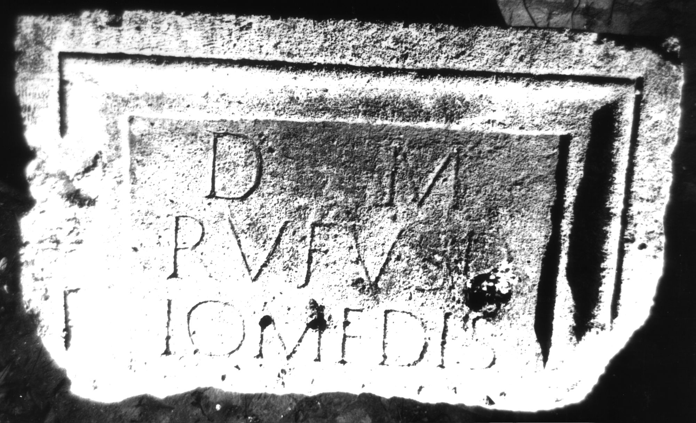
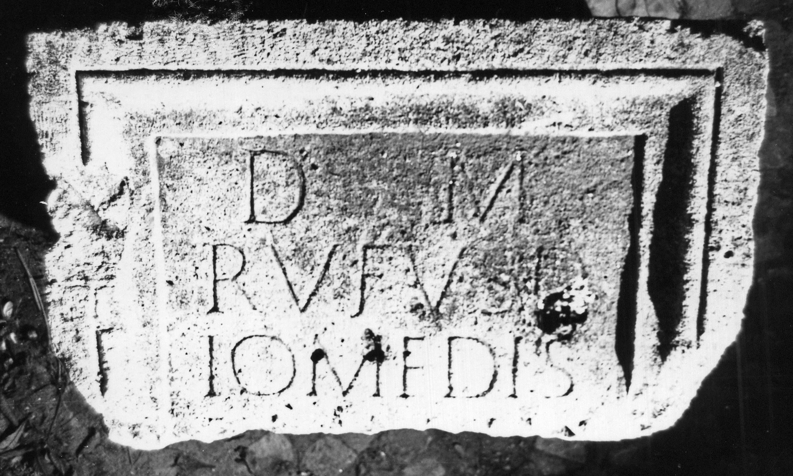

# EDH HD000754. Apulum

**Країна.** Румунія

**Провінція (код EDH).** Dac

**Місце знахідки (антична назва).** Apulum

**Сучасна назва.** Alba Iulia

**Деталі знахідки.** {Partoş}

**Координати.** 46.0463184,23.566650100

**Рік знахідки.** 1979

**Зберігання.** Alba Iulia, Muz. Unirii

**Датування (роки, від'ємні до н. е.).** 131 … 200

**Матеріал.** Kalkstein

**Тип пам'ятки.** Altar?

**Розміри (висота, ширина, глибина, см).** -55.0 × 85.0 × 74.0

## Текст (латинь, скорочення розкрито)

```
D(is) M(anibus) / Rufus D/iomedis / v(ixit) an(nos) I(?)V / [&
```

## Текст у вихідному записі

```
D M / RVFVS D / IOMEDIS / V AN IV / [
```

## Коментар

Mittelteil wohl eines Altars oder vielleicht einer Statuenbasis; auf der linken Nebenseite weibliche Figur im Trauergestus, auf der rechten geflügelter Genius. Z. 4: nur die oberen Buchstabenenden erhalten; statt I auch L möglich. (B): Băluţă; AE 1983: Z. 4: nicht gelesen.

## Література

AE 1983, 0818. (B)
- C.L. Băluţă, Apulum 21, 1983, 92, Nr. 5; fig. 5 (Fotos u. Zeichnung). (B) - AE 1983.
- C. Ciongradi, Grabmonument und sozialer Status in Oberdakien (Cluj-Napoca 2007) 232, Nr. Sc/A 8; Taf. 87.
- IDR 3, 5, 567; Foto u. Zeichnung. #

## Фото





Джерело https://edh.ub.uni-heidelberg.de/edh/inschrift/HD000754, ліцензія CC BY-SA 4.0. Оригінальний XML в архіві сирі_дані/edh_xml.zip
