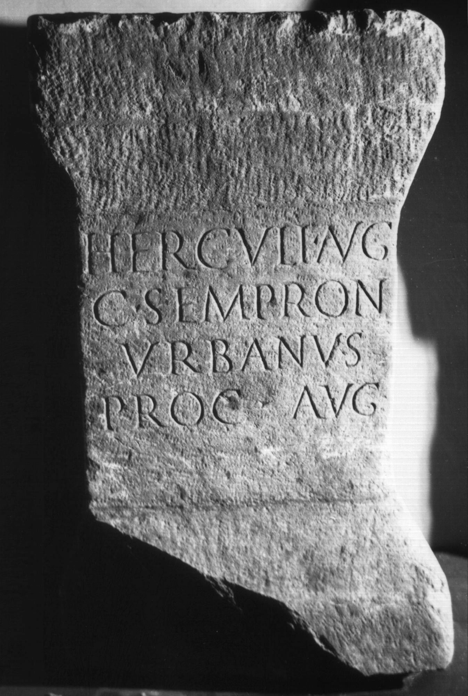

# EDH HD000760. Colonia Ulpia Traiana Sarmizegetusa

**Країна.** Румунія

**Провінція (код EDH).** Dac

**Місце знахідки (антична назва).** Colonia Ulpia Traiana Sarmizegetusa

**Сучасна назва.** Sarmizegetusa

**Деталі знахідки.** {Praetorium procuratoris}

**Координати.** 45.514961240,22.787961957

**Рік знахідки.** 1979

**Зберігання.** Sarmizegetusa, Muz. Arh.

**Датування (роки, від'ємні до н. е.).** 182 … 185

**Тип пам'ятки.** Altar?

**Розміри (висота, ширина, глибина, см).** 72.0 × 42.5 × 40.5

## Текст (латинь, скорочення розкрито)

```
Herculi Aug(usto) / C(aius) Sempron(ius) / Urbanus / proc(urator) Aug(usti)
```

## Текст у вихідному записі

```
HERCVLI AVG / C SEMPRON / VRBANVS / PROC AVG
```

## Коментар

Altar oder Statuenbasis. Datierung: C. Sempronius Urbanus war bald nach 181 n. Chr. Finanzprokurator in Dakien.

## Література

AE 1983, 0826.
- AE 1996, 0873.
- ILD 250.
- I. Piso, ZPE 50, 1983, 235-236, Nr. 1; Taf. 13, 1. - AE 1983.
- S. Dardaine, Ktema 21, 1996, 295-304. - AE 1996.
- H.-G. Pflaum, Les carrières procuratoriennes équestres sous le Haut-Empire romain (Paris 1960/61) 542-543, Nr. 200. #

## Фото



Джерело https://edh.ub.uni-heidelberg.de/edh/inschrift/HD000760, ліцензія CC BY-SA 4.0. Оригінальний XML в архіві сирі_дані/edh_xml.zip
