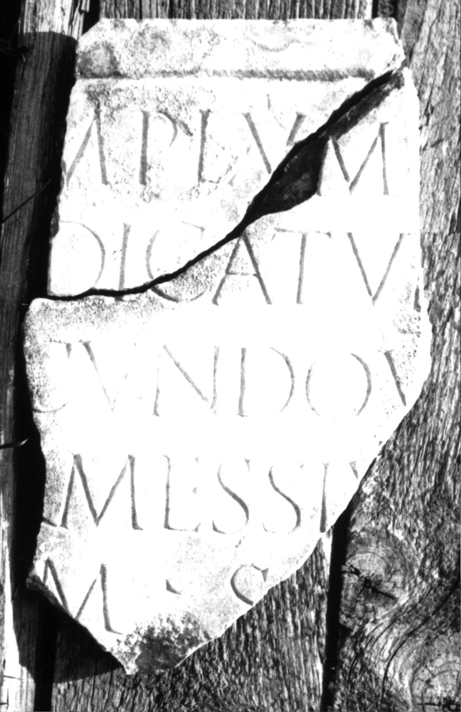
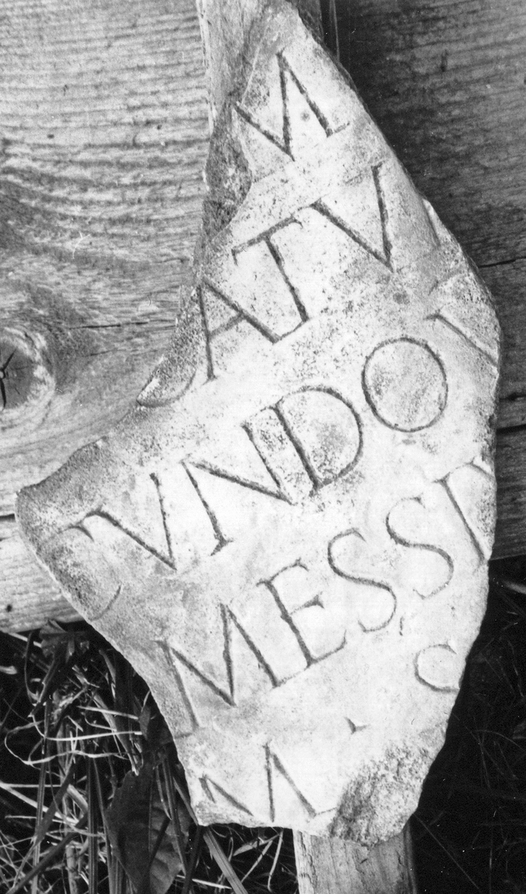
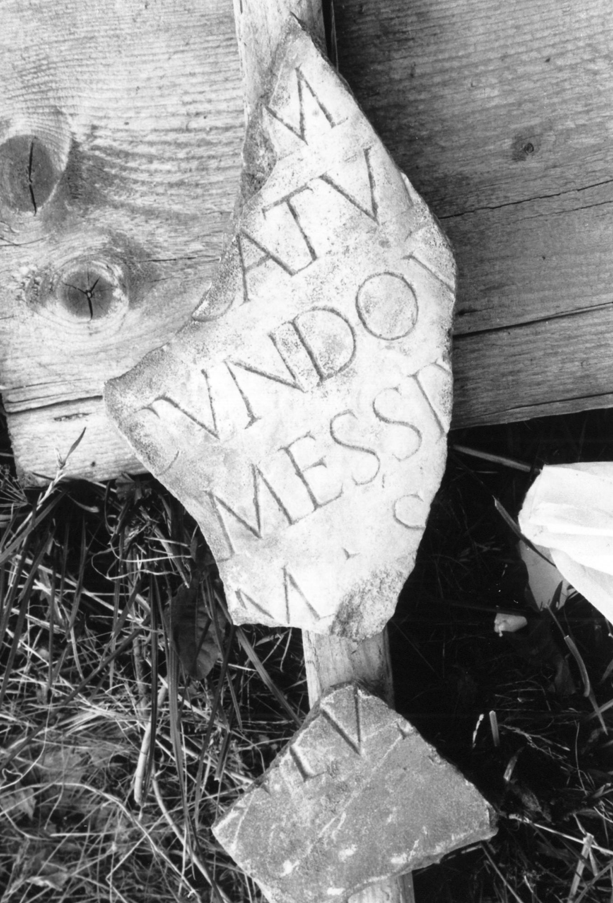

# EDH HD000769. Colonia Ulpia Traiana Sarmizegetusa

**Країна.** Румунія

**Провінція (код EDH).** Dac

**Місце знахідки (антична назва).** Colonia Ulpia Traiana Sarmizegetusa

**Сучасна назва.** Sarmizegetusa

**Деталі знахідки.** {Praetorium procuratoris}

**Координати.** 45.514961240,22.787961957

**Рік знахідки.** 1979

**Зберігання.** Sarmizegetusa, Muz. Arh.

**Датування (роки, від'ємні до н. е.).** 201 … 250

**Тип пам'ятки.** Tafel

**Розміри (висота, ширина, глибина, см).** -30.0 × -18.5 × 2.0

## Текст (латинь, скорочення розкрито)

```
[Te]mplum [---] / [de]dicatum [a Temonio?] / [Se]cundo v(iro) [e(gregio) proc(uratore) Aug(usti)] / [pe]r Messiu[m ---]/[--]m S[---] / [&?
```

## Текст у вихідному записі

```
[ ]MPLVM [ ] / [ ]DICATVM [ ] / [ ]CVNDO V [ ] / [ ]R MESSIV[ ] / [ ]M S[ ] / [
```

## Коментар

2 aneinanderpassende Fragmente erhalten. Zum Dedikanten s. auch AE 1982, 829 = IDR III 2, 338. (B): Daicoviciu - Alicu - Piso; AE 1983; ILD: Leseabweichungen.

## Література

AE 1983, 0832. (B)
- I. Piso, ZPE 50, 1983, 240-241, Nr. 7; Taf. 13,7; Zeichnung. - AE 1983.
- H. Daicoviciu - D. Alicu - I. Piso, MatCercA 15, 1981, 275, Nr. 8. (B)
- ILD 256. (B) #

## Фото







Джерело https://edh.ub.uni-heidelberg.de/edh/inschrift/HD000769, ліцензія CC BY-SA 4.0. Оригінальний XML в архіві сирі_дані/edh_xml.zip
