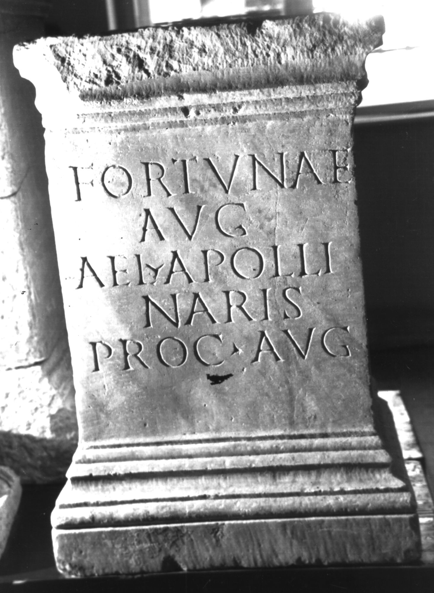

# EDH HD000772. Colonia Ulpia Traiana Sarmizegetusa

**Країна.** Румунія

**Провінція (код EDH).** Dac

**Місце знахідки (антична назва).** Colonia Ulpia Traiana Sarmizegetusa

**Сучасна назва.** Sarmizegetusa

**Деталі знахідки.** {Praetorium procuratoris}

**Координати.** 45.514961240,22.787961957

**Рік знахідки.** 1979

**Зберігання.** Sarmizegetusa, Muz. Arh.

**Датування (роки, від'ємні до н. е.).** 212 … 235

**Тип пам'ятки.** Statuenbasis?

**Розміри (висота, ширина, глибина, см).** 84.5 × 58.5 × 42.5

## Текст (латинь, скорочення розкрито)

```
Fortunae / Aug(ustae) / Ael(ius) Apolli/naris / proc(urator) Aug(usti)
```

## Текст у вихідному записі

```
FORTVNAE / AVG / AEL APOLLI / NARIS / PROC AVG
```

## Коментар

Inschriftträger: möglicherweise auch ein Altar. Datierung: Die Finanzprokuratur des Aelius Apollinaris fällt wahrscheinlich in die spätseverische Zeit.

## Література

AE 1983, 0831.
- I. Piso, ZPE 50, 1983, 239-240, Nr. 6; Taf. 13, 6. - AE 1983.
- H. Daicoviciu - D. Alicu - I. Piso, MatCercA 15, 1981, 275, Nr. 7; fig. 26, 2.
- ILD 255. #

## Фото



Джерело https://edh.ub.uni-heidelberg.de/edh/inschrift/HD000772, ліцензія CC BY-SA 4.0. Оригінальний XML в архіві сирі_дані/edh_xml.zip
