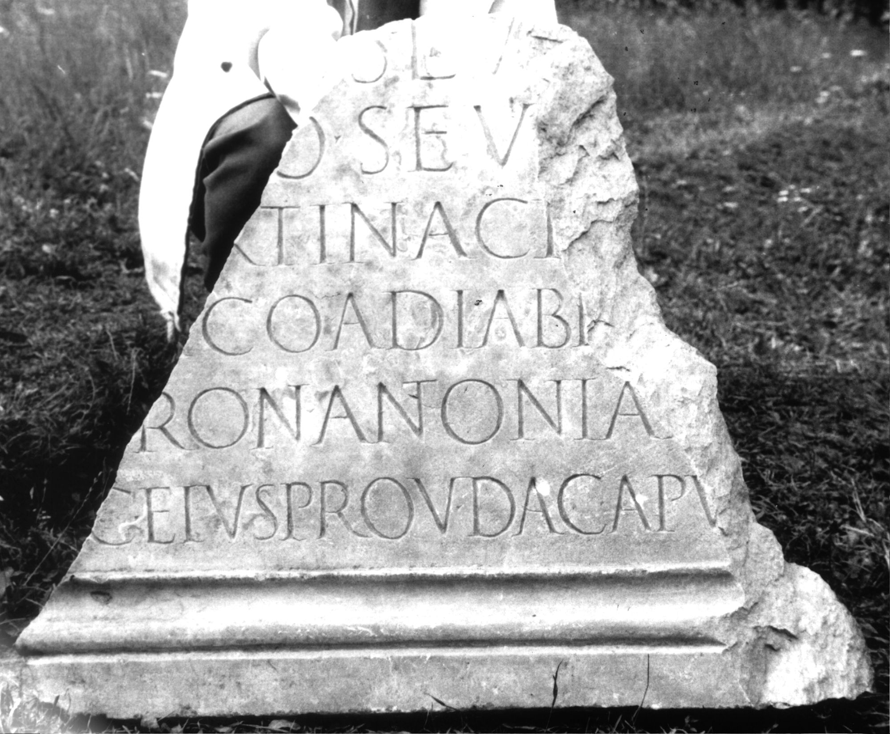
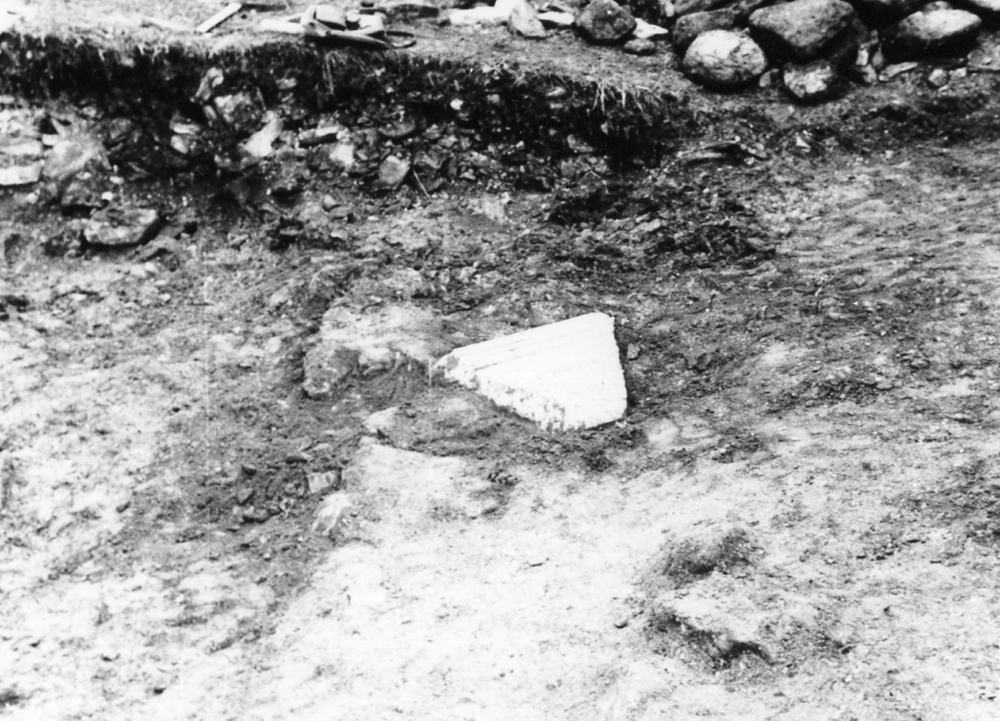
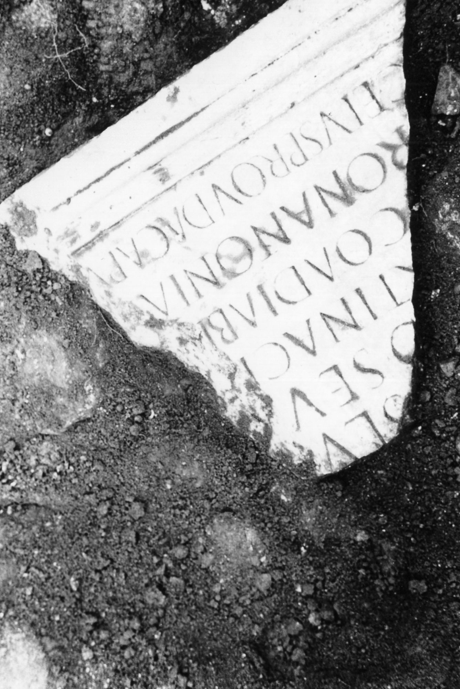

# EDH HD000781. Colonia Ulpia Traiana Sarmizegetusa

**Країна.** Румунія

**Провінція (код EDH).** Dac

**Місце знахідки (антична назва).** Colonia Ulpia Traiana Sarmizegetusa

**Сучасна назва.** Sarmizegetusa

**Деталі знахідки.** {Praetorium procuratoris}

**Координати.** 45.514961240,22.787961957

**Рік знахідки.** 1980

**Зберігання.** Sarmizegetusa, Muz. Arh.

**Датування (роки, від'ємні до н. е.).** 195 … 198

**Тип пам'ятки.** Tafel

**Розміри (висота, ширина, глибина, см).** -62.5 × -77.0 × 7.0

## Текст (латинь, скорочення розкрито)

```
[Imp(eratori) Cae]s(ari) Lu[cio] / [Septimi]o Sev[ero] / [Pio Pe]rtinaci [Aug(usto)] / [Arab]ico Adiabe[nico] / [---]ron(ius) Antonian[us] / [pro]c(urator) eius prov(inciae) Dac(iae) Apu[l(ensis)]
```

## Текст у вихідному записі

```
[ ]S LV[ ] / [ ]O SEV[ ] / [ ]RTINACI [ ] / [ ]ICO ADIABE[ ] / [ ]RON ANTONIAN[ ] / [ ]C EIVS PROV DAC APV[ ]
```

## Коментар

Datierung: zwischen Sommer 195 und Anfang 198 n. Chr., da die Siegerbeinamen Arabicus Adiabenicus bereits vorhanden sind, Parthicus Maximus aber noch fehlt. (B): Daicoviciu - Alicu - Piso; Piso, ZPE; AE 1983; ILD: Leseabweichungen.

## Література

AE 1983, 0830. (B)
- I. Piso, ZPE 50, 1983, 238-239, Nr. 5; Taf. 13, 5; Zeichnung. (B) - AE 1983.
- H. Daicoviciu - D. Alicu - I. Piso, MatCercA 15, 1981, 273, Nr. 1; fig. 24, 1 (Foto u. Zeichnung). (B)
- ILD 254. #

## Фото







Джерело https://edh.ub.uni-heidelberg.de/edh/inschrift/HD000781, ліцензія CC BY-SA 4.0. Оригінальний XML в архіві сирі_дані/edh_xml.zip
