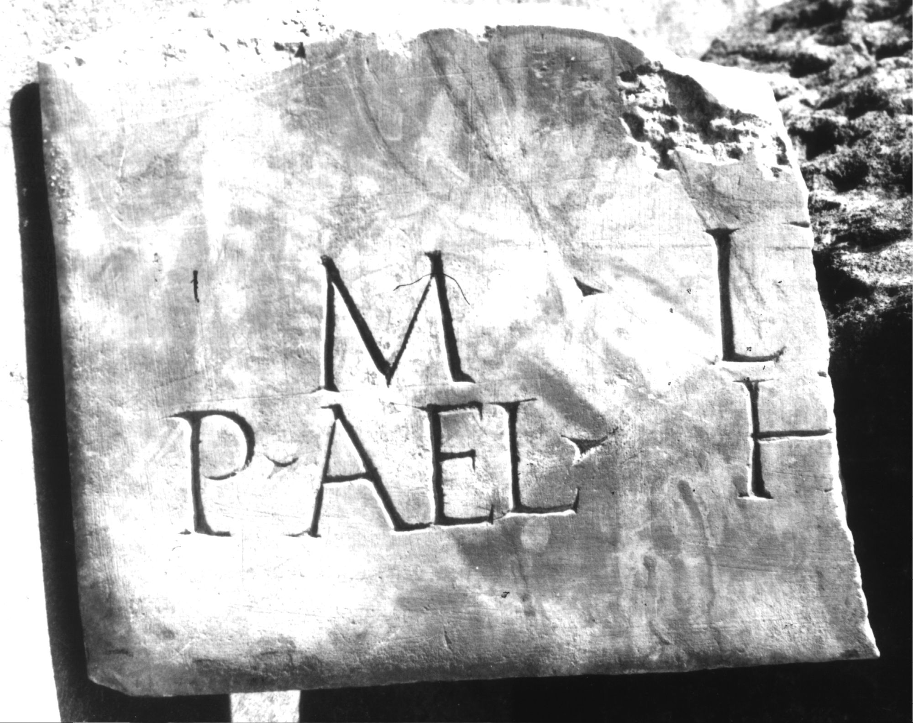

# EDH HD000784. Colonia Ulpia Traiana Sarmizegetusa

**Країна.** Румунія

**Провінція (код EDH).** Dac

**Місце знахідки (антична назва).** Colonia Ulpia Traiana Sarmizegetusa

**Сучасна назва.** Sarmizegetusa

**Деталі знахідки.** {Praetorium procuratoris}

**Координати.** 45.514961240,22.787961957

**Рік знахідки.** 1979

**Зберігання.** Sarmizegetusa, Muz. Arh.

**Датування (роки, від'ємні до н. е.).** 224 … 235

**Тип пам'ятки.** Tafel

**Розміри (висота, ширина, глибина, см).** -24.0 × -29.0 × 3.5

## Текст (латинь, скорочення розкрито)

```
$] / [[[Iuliae Mamaeae]] sanctissimae Aug(ustae)] / [[m[atris]] Aug(usti) n(ostri) et castrorum] / M(arcus) Lu[cceius Felix proc(urator) Aug(usti) n(ostri)] / P(ublius) Ael(ius) H[---]
```

## Текст у вихідному записі

```
] / [[[ ]]] / [[M[ ]]] / M LV[ ] / P AEL H[ ]
```

## Коментар

Zeilenlinien für die Beschriftung. Z. 2 (Ende): vom V nur noch der Rest des ersten cornu erhalten. Z. 3 wurde nachträglich hinzugefügt. Ergänzung nach Piso, ZPE 120, 1998.

## Література

AE 1983, 0834.
- I. Piso, ZPE 50, 1983, 242-244, Nr. 9; Taf. 14, 9; Zeichnung. - AE 1983.
- H. Daicoviciu - D. Alicu - I. Piso, MatCercA 15, 1981, 273, Nr. 3.
- AE 1998, 1092.
- I. Piso, ZPE 120, 1998, 260-261, Nr. 5. - AE 1998.
- ILD 269. #

## Фото



Джерело https://edh.ub.uni-heidelberg.de/edh/inschrift/HD000784, ліцензія CC BY-SA 4.0. Оригінальний XML в архіві сирі_дані/edh_xml.zip
