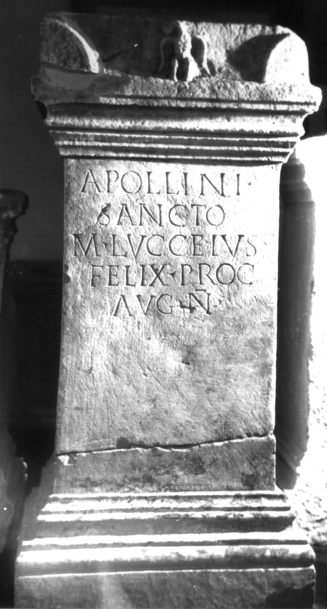
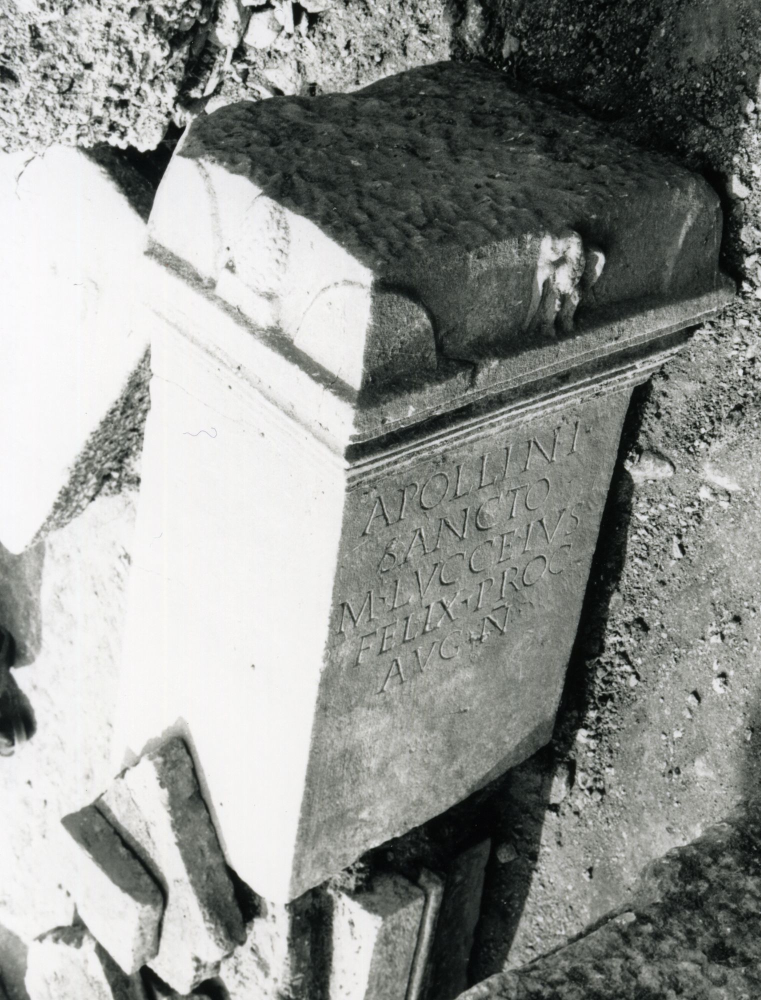
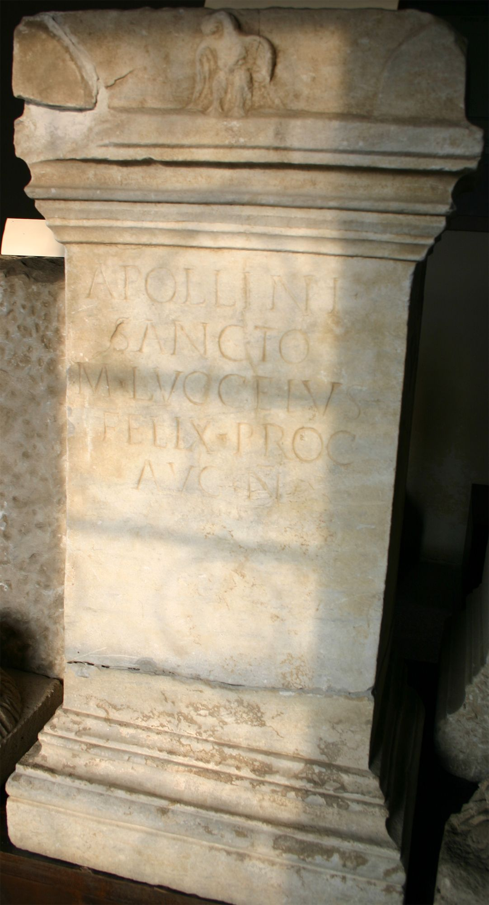
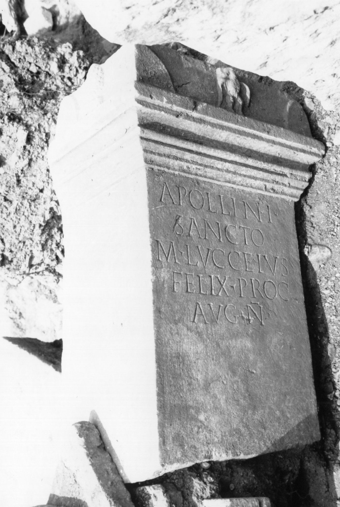

# EDH HD000787. Colonia Ulpia Traiana Sarmizegetusa

**Країна.** Румунія

**Провінція (код EDH).** Dac

**Місце знахідки (антична назва).** Colonia Ulpia Traiana Sarmizegetusa

**Сучасна назва.** Sarmizegetusa

**Деталі знахідки.** {Praetorium procuratoris}

**Координати.** 45.514961240,22.787961957

**Рік знахідки.** 1979

**Зберігання.** Sarmizegetusa, Muz. Arh.

**Датування (роки, від'ємні до н. е.).** 222 … 235

**Тип пам'ятки.** Altar

**Розміри (висота, ширина, глибина, см).** 120.0 × 57.0 × 36.0

## Текст (латинь, скорочення розкрито)

```
Apollini / sancto / M(arcus) Lucceius / Felix proc(urator) / Aug(usti) n(ostri)
```

## Текст у вихідному записі

```
APOLLINI / SANCTO / M LVCCEIVS / FELIX PROC / AVG N
```

## Коментар

In 2 Teile gebrochen; auf der Vorderseite der corona ein Adler, auf der linken Seite ein Kieferzapfen, auf der rechten Seite ein Stierkopf. Datierung: M. Lucceius Felix war unter Severus Alexander Finanzprokurator in Dakien (s. AE 1983, 834).

## Література

AE 1983, 0835.
- I. Piso, ZPE 50, 1983, 244-245, Nr. 10; Taf. 14, 10. - AE 1983.
- H. Daicoviciu - D. Alicu - I. Piso, MatCercA 15, 1981, 273-274, Nr. 4; fig. 25, 1.
- ILD 258. #

## Фото









Джерело https://edh.ub.uni-heidelberg.de/edh/inschrift/HD000787, ліцензія CC BY-SA 4.0. Оригінальний XML в архіві сирі_дані/edh_xml.zip
