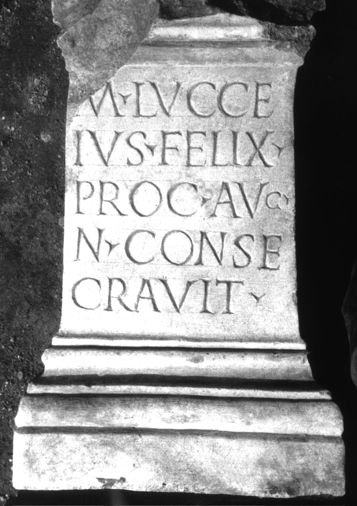

# EDH HD000823. Colonia Ulpia Traiana Sarmizegetusa

**Країна.** Румунія

**Провінція (код EDH).** Dac

**Місце знахідки (антична назва).** Colonia Ulpia Traiana Sarmizegetusa

**Сучасна назва.** Sarmizegetusa

**Деталі знахідки.** {Praetorium procuratoris}

**Координати.** 45.514961240,22.787961957

**Рік знахідки.** 1979

**Зберігання.** Sarmizegetusa, Muz. Arh.

**Датування (роки, від'ємні до н. е.).** 222 … 235

**Тип пам'ятки.** Statuenbasis?

**Розміри (висота, ширина, глибина, см).** 69.0 × 39.5 × 30.5

## Текст (латинь, скорочення розкрито)

```
M(arcus) Lucce/ius Felix / proc(urator) Aug(usti) / n(ostri) conse/cravit
```

## Текст у вихідному записі

```
M LVCCE / IVS FELIX / PROC AVG / N CONSE / CRAVIT
```

## Коментар

Statuenbasis oder Altar. Zeilenlinien für die Beschriftung. Datierung: M. Lucceius Felix war unter Severus Alexander Finanzprokurator in Dakien (vgl. AE 1983, 834).

## Література

AE 1983, 0838.
- I. Piso, ZPE 50, 1983, 246, Nr. 13; Taf. 14, 13. - AE 1983.
- H. Daicoviciu - D. Alicu - I. Piso, MatCercA 15, 1981, 274-275, Nr. 6; fig. 25, 2.
- ILD 261. #

## Фото



Джерело https://edh.ub.uni-heidelberg.de/edh/inschrift/HD000823, ліцензія CC BY-SA 4.0. Оригінальний XML в архіві сирі_дані/edh_xml.zip
