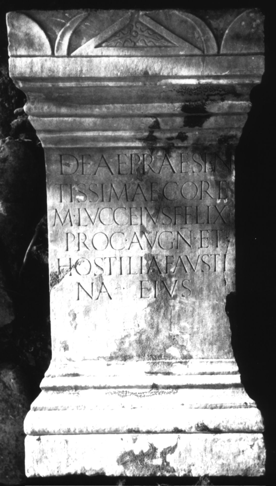

# EDH HD000826. Colonia Ulpia Traiana Sarmizegetusa

**Країна.** Румунія

**Провінція (код EDH).** Dac

**Місце знахідки (антична назва).** Colonia Ulpia Traiana Sarmizegetusa

**Сучасна назва.** Sarmizegetusa

**Деталі знахідки.** {Praetorium procuratoris}

**Координати.** 45.514961240,22.787961957

**Рік знахідки.** 1979

**Зберігання.** Sarmizegetusa, Muz. Arh.

**Датування (роки, від'ємні до н. е.).** 222 … 235

**Тип пам'ятки.** Altar

**Розміри (висота, ширина, глибина, см).** 112.0 × 60.0 × 44.0

## Текст (латинь, скорочення розкрито)

```
Deae praesen/tissimae Core / M(arcus) Lucceius Felix / proc(urator) Aug(usti) n(ostri) et / Hostilia Fausti/na eius
```

## Текст у вихідному записі

```
DEAE PRAESEN / TISSIMAE CORE / M LVCCEIVS FELIX / PROC AVG N ET / HOSTILIA FAVSTI / NA EIVS
```

## Коментар

Zeilenlinien für die Beschriftung. Datierung: M. Lucceius Felix war unter Severus Alexander Finanzprokurator in Dakien (vgl. AE 1983, 834).

## Література

AE 1983, 0840.
- I. Piso, ZPE 50, 1983, 246-247, Nr. 15; Taf. 14, 15. - AE 1983.
- ILD 263. #

## Фото



Джерело https://edh.ub.uni-heidelberg.de/edh/inschrift/HD000826, ліцензія CC BY-SA 4.0. Оригінальний XML в архіві сирі_дані/edh_xml.zip
