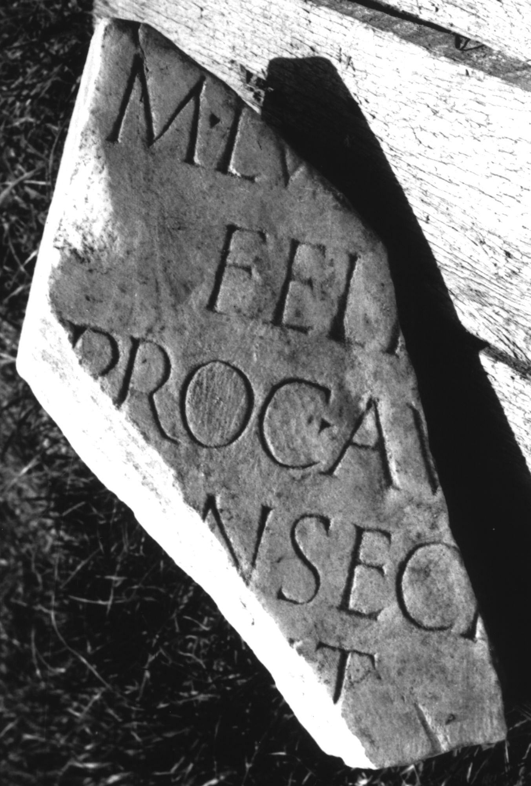

# EDH HD000829. Colonia Ulpia Traiana Sarmizegetusa

**Країна.** Румунія

**Провінція (код EDH).** Dac

**Місце знахідки (антична назва).** Colonia Ulpia Traiana Sarmizegetusa

**Сучасна назва.** Sarmizegetusa

**Деталі знахідки.** {Praetorium procuratoris}

**Координати.** 45.514961240,22.787961957

**Рік знахідки.** 1979

**Зберігання.** Sarmizegetusa, Muz. Arh.

**Датування (роки, від'ємні до н. е.).** 222 … 235

**Тип пам'ятки.** Tafel

**Розміри (висота, ширина, глибина, см).** -28.0 × -25.0 × 14.0

## Текст (латинь, скорочення розкрито)

```
M(arcus) Luc[ceius] / Feli[x] / proc(urator) Au[g(usti) n(ostri)] / [co]nsecr[a]/[v]it
```

## Текст у вихідному записі

```
M LVC[ ] / FELI[ ] / PROC AV[ ] / [ ]NSECR[ ] / [ ]IT
```

## Коментар

Datierung: M. Lucceius Felix war unter Severus Alexander Finanzprokurator in Dakien (vgl. AE 1983, 834).

## Література

AE 1983, 0839.
- I. Piso, ZPE 50, 1983, 246, Nr. 14; Taf. 14, 14; Zeichnung. - AE 1983.
- ILD 262. #

## Фото



Джерело https://edh.ub.uni-heidelberg.de/edh/inschrift/HD000829, ліцензія CC BY-SA 4.0. Оригінальний XML в архіві сирі_дані/edh_xml.zip
