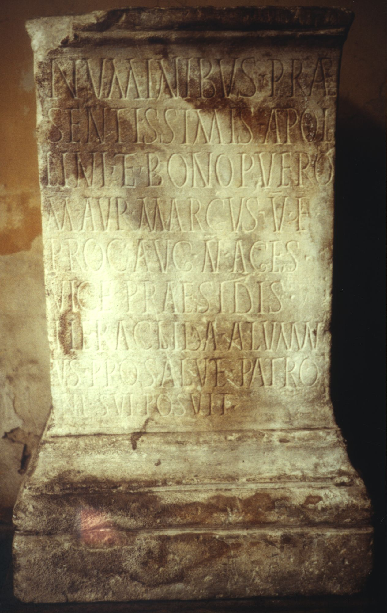
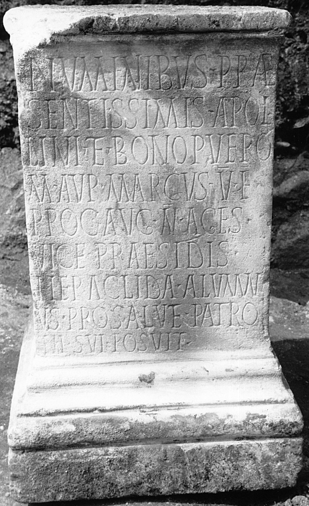

# EDH HD000832. Colonia Ulpia Traiana Sarmizegetusa

**Країна.** Румунія

**Провінція (код EDH).** Dac

**Місце знахідки (антична назва).** Colonia Ulpia Traiana Sarmizegetusa

**Сучасна назва.** Sarmizegetusa

**Деталі знахідки.** {Praetorium procuratoris}

**Координати.** 45.514961240,22.787961957

**Рік знахідки.** 1979

**Зберігання.** Sarmizegetusa, Muz. Arh.

**Датування (роки, від'ємні до н. е.).** 251 … 253

**Тип пам'ятки.** Altar?

**Розміри (висота, ширина, глибина, см).** -74.0 × 47.0 × 44.0

## Текст (латинь, скорочення розкрито)

```
Numinibus prae/sentissimis Apol/lini et Bono Puero / M(arcus) Aur(elius) Marcus v(ir) e(gregius) / proc(urator) Aug(usti) n(ostri) age(n)s / vice praesidis / Heraclida alumn/us pro salute patro/ni sui posuit
```

## Текст у вихідному записі

```
NVMINIBVS PRAE / SENTISSIMIS APOL / LINI ET BONO PVERO / M AVR MARCVS V E / PROC AVG N AGES / VICE PRAESIDIS / HERACLIDA ALVMN / VS PRO SALVTE PATRO / NI SVI POSVIT
```

## Коментар

Altar oder Statuenbasis. Zeilenlinien für die Beschriftung. Datierung: Prokuratur des M. Aur. Marcus in Dakien.

## Література

AE 1983, 0841.
- I. Piso, ZPE 50, 1983, 247-248, Nr. 16; Taf. 15, 16. - AE 1983.
- H. Daicoviciu - D. Alicu - I. Piso, MatCercA 15, 1981, 275, fig. 26, 3.
- ILD 264. #

## Фото





Джерело https://edh.ub.uni-heidelberg.de/edh/inschrift/HD000832, ліцензія CC BY-SA 4.0. Оригінальний XML в архіві сирі_дані/edh_xml.zip
