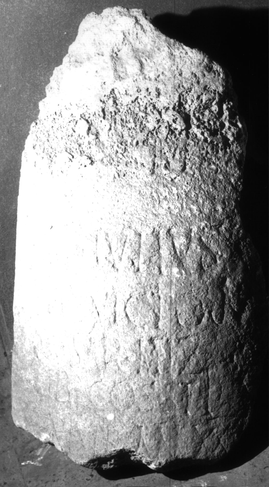
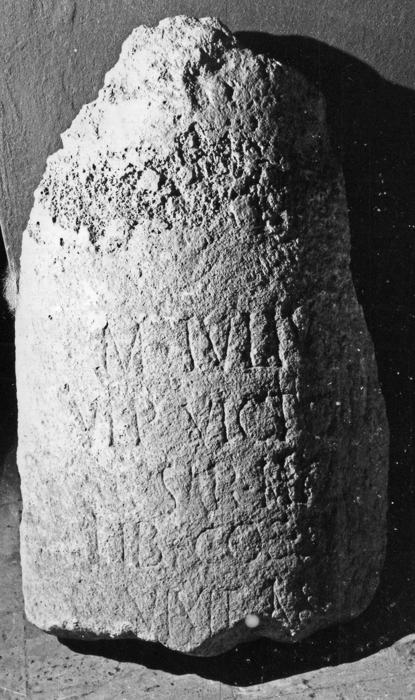

# EDH HD001089. Apulum

**Країна.** Румунія

**Провінція (код EDH).** Dac

**Місце знахідки (антична назва).** Apulum

**Сучасна назва.** Alba Iulia

**Деталі знахідки.** {Partoş}, Lăbuţ

**Координати.** 46.044053263,23.566859616

**Рік знахідки.** 1936

**Зберігання.** Alba Iulia, Muz. Unirii

**Датування (роки, від'ємні до н. е.).** 168 … 300

**Матеріал.** Kalkstein

**Тип пам'ятки.** Architekturteil

**Розміри (висота, ширина, глибина, см).** -75.0 × 50.0

## Текст (латинь, скорочення розкрито)

```
D(is) M(anibus) / M(arcus) Iulius [M(arci)? f(ilius)?] / Ulp(ia) Victorinus / Sarmiz(egetusa) / lib(rarius) co(n)s(ularis) stip(endiorum) V / vixit an(nis) XXI[II] / [&
```

## Текст у вихідному записі

```
D M / M IVLIVS [ ] / VLP VICTORINVS / SARMIZ / LIB COS STIP V / VIXIT AN XXI[ ] / [
```

## Коментар

Fragment eines Säulenschafts. (B): Radu, AE 1967, Forni, AE 1982: geringfügig abweichende Lesungen. Textwiedergabe nach IDR. Pseudotribus Ulpia (anstelle von Papiria).

## Література

AE 1982, 0825.
- G. Forni, ZPE 46, 1982, 188-189, Nr. 1. - AE 1982.
- D. Radu, Apulum 4, 1961, 111-112, Nr. 23; fig. 23 (Zeichnung). (B) - AE 1982.
- AE 1967, 0386. (B)
- N. Gostar, AMold 4, 1966, 177; fig. 3 (Zeichnung). - AE 1967.
- IDR 3, 5, 544; Foto u. Zeichnung.
- C. Ciongradi, Grabmonument und sozialer Status in Oberdakien (Cluj-Napoca 2007) 260, Nr. G/A 3. #

## Фото





Джерело https://edh.ub.uni-heidelberg.de/edh/inschrift/HD001089, ліцензія CC BY-SA 4.0. Оригінальний XML в архіві сирі_дані/edh_xml.zip
