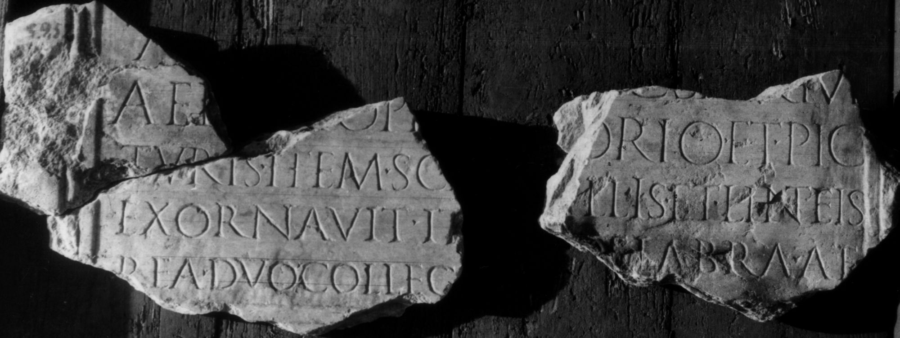

# EDH HD001155. Colonia Ulpia Traiana Sarmizegetusa

**Країна.** Румунія

**Провінція (код EDH).** Dac

**Місце знахідки (антична назва).** Colonia Ulpia Traiana Sarmizegetusa

**Сучасна назва.** Sarmizegetusa

**Деталі знахідки.** {Forum Vetus, Nordwestecke} (Fragment a); {Forum Vetus, Hof} (Fragment b,c)

**Координати.** 45.513549731,22.787318229

**Рік знахідки.** 1924

**Зберігання.** Sarmizegetusa, Muz. Arh.

**Датування (роки, від'ємні до н. е.).** 161 … 192

**Тип пам'ятки.** Tafel

**Розміри (висота, ширина, глибина, см).** -18.0 × -29.0 × 4.0

## Текст (латинь, скорочення розкрито)

```
$] / August[alis col(oniae) D]ac(icae) Sarm(izegetusae) / aedem ope[re tect]orio et pic/turis item sca[lis sigi?]llis et linteis / exornavit it[em can]delabra ae/rea duo colleg[io dedit dedicavit]q[ue]
```

## Текст у вихідному записі

```
] / AVGVST[ ]AC SARM / AEDEM OPE[ ]ORIO ET PIC / TVRIS ITEM SCA[ ]LLIS ET LINTEIS / EXORNAVIT IT[ ]DELABRA AE / REA DVO COLLEG[ ]Q[ ]
```

## Коментар

Fünf teilweise aneinander passende Fragmente erhalten. (B): Russu, AE 1977: Abweichungen in Lesung und Ergänzung.

## Література

AE 1982, 0831.
- I. Piso, StudClas 18, 1979, 141-142, Nr. 3; Abb. 3 a; Abb. 3 b (Zeichnung). - AE 1982.
- AE 1977, 0667. (B)
- I.I. Russu, StCercIstorV 25, 1974, 585-587, Nr. 1; fig. 1 a; fig. 1 b (Zeichnung). (B) - AE 1977.
- IDR 3, 2, 004; fig. 4 (Foto u. Zeichnung).
- I. Piso, in: I. Piso (Hrsg.), Le forum vetus de Sarmizegetusa 1 (Bucureşti 2006) 261-263, Nr. 40; Fig. 3, 38 (Fotos u. Zeichnung).
- I. Piso, in: HPS 13 (Debrecen 2006) 108-109. - AE 2006.
- AE 2006, 1154. #

## Фото



Джерело https://edh.ub.uni-heidelberg.de/edh/inschrift/HD001155, ліцензія CC BY-SA 4.0. Оригінальний XML в архіві сирі_дані/edh_xml.zip
