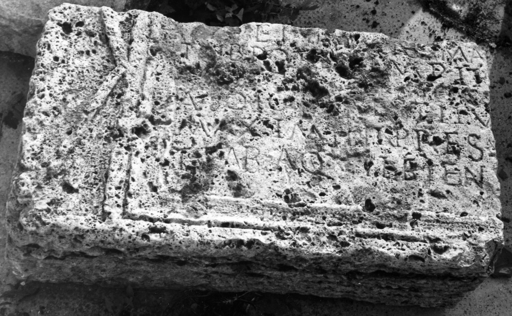
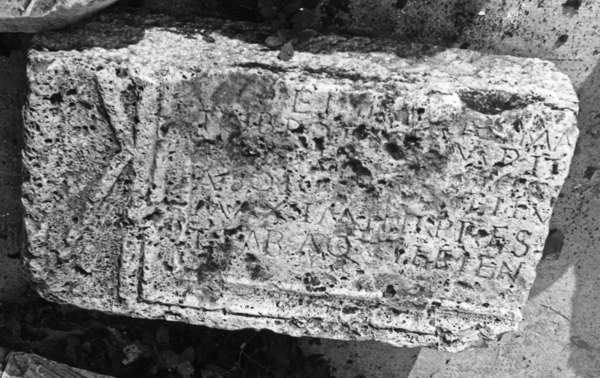
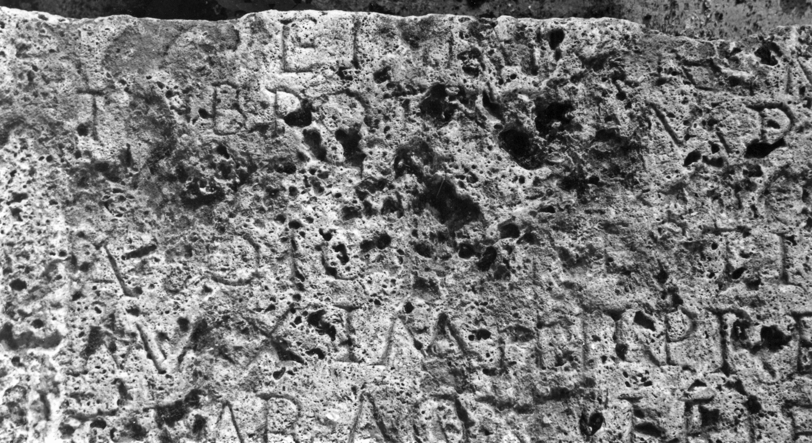

# EDH HD001164. Germisara

**Країна.** Румунія

**Провінція (код EDH).** Dac

**Місце знахідки (антична назва).** Germisara

**Сучасна назва.** Rapoltu Mare

**Деталі знахідки.** "Castel Sándor Ernő"

**Координати.** 45.867307381,23.070245683

**Рік знахідки.** 1963

**Зберігання.** Deva, Muz. Civil. Dac. şi Rom.

**Датування (роки, від'ємні до н. е.).** 208 … 

**Тип пам'ятки.** Tafel

**Розміри (висота, ширина, глибина, см).** -45.0 × -84.0 × 24.0

## Текст (латинь, скорочення розкрито)

```
[Imp(erator) Caes(ar) L(ucius) Sept(imius) Severus Pert(inax) Aug(ustus) --- trib(unicia) pot(estate) XVI imp(erator) XI ---] / et Imp(erator) Caes(ar) M(arcus) Au[r(elius) Ant(oninus) Aug(ustus) ---] / trib(unicia) pot(estate) [X]I imp(erator) II [[--- et P(ublius) Sept(imius)]] / [[Geta nobiliss(imus)]] C[[aes(ar) ---]] / a solo restitu[er(unt) cura C(ai) Iul(i)] / Maximini pr(a)es(idis) [Daciar(um) III instante?] / T(ito) Fab(io) Aquileiens[i trib(uno) n(umeri) p(editum) s(ingularium) B(ritannicorum)?]
```

## Текст у вихідному записі

```
[ ] / ET IMP CAES M AV[ ] / TRIB POT [ ]I IMP II [[ ET P SEPT]] / [[GETA NOBILISS]] C[[AES ]] / A SOLO RESTITV[ ] / MAXIMINI PRES [ ] / T FAB AQVILEIENS[ ]
```

## Коментар

(B): Z. 2: AE 1971: trib(unicia) potes(tate) imp(erator) II; Russu: trib(uniciae) potes(tatis) imp(erator) II. Letzte Zeile: Für die Ergänzung [trib(uno)] statt [praef(ecto)] vgl. AE 1992, 1487.

## Література

AE 1982, 0833.
- I. Piso, ActaMusNapoca 16, 1979, 82-86, Nr. 3; fig. 5 u. 7; fig. 6 u. 8 (Zeichnungen). - AE 1982.
- AE 1971, 0385. (B)
- I.I. Russu, StCercIstorV 19, 1968, 667-675; fig. 1a; fig. 1b (Zeichnung). (B) - AE 1971.
- AE 2010, 1377.
- R. Ardevan, ACD 46, 2010, 125-126. - AE 2010.
- IDR 3, 3, 213; fig. 165 (Foto u. Zeichnung).
- PIR (2. Aufl.) I 419. #

## Фото







Джерело https://edh.ub.uni-heidelberg.de/edh/inschrift/HD001164, ліцензія CC BY-SA 4.0. Оригінальний XML в архіві сирі_дані/edh_xml.zip
