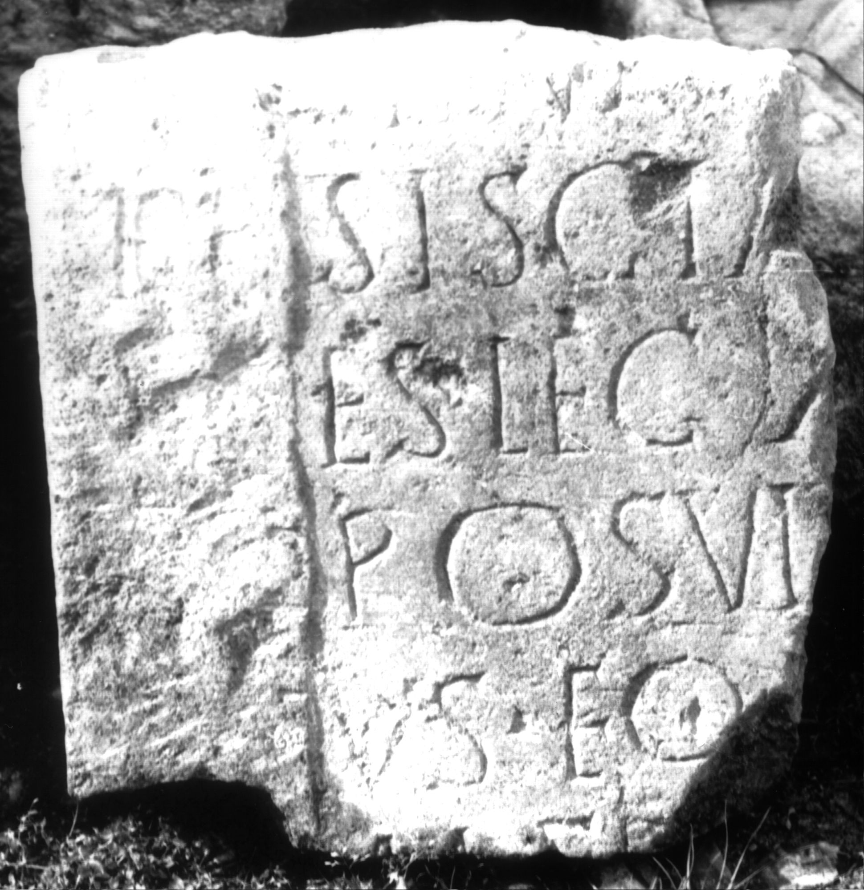

# EDH HD001774. Apulum

**Країна.** Румунія

**Провінція (код EDH).** Dac

**Місце знахідки (антична назва).** Apulum

**Сучасна назва.** Alba Iulia

**Деталі знахідки.** Festung, {S. Michael, katholische Kathedrale}, sekundär verwendet

**Координати.** 46.067648088,23.569900989

**Рік знахідки.** 1961

**Зберігання.** Alba Iulia, katholischer Bischofssitz

**Датування (роки, від'ємні до н. е.).** 201 … 270

**Матеріал.** Sandstein

**Тип пам'ятки.** Stele

**Розміри (висота, ширина, глибина, см).** -46.0 × -43.0 × 13.5

**Стан збереження.** F

## Текст (латинь, скорочення розкрито)

```
$] / [-]I(?)I(?)NI(?)[-? domo?] / Siscia [mil]/es leg(ionis) X[III g(eminae)] / posuit [---]/us eq(ues) [bene] / mer[enti]
```

## Текст у вихідному записі

```
] / [ ]IINI[ ] / SISCIA [ ] / ES LEG X[ ] / POSVIT [ ] / VS EQ [ ] / MER[ ]
```

## Коментар

Z. 1: nur die untere Hälfte der Buchstaben erhalten. Berciu - Popa, Apulum; AE 1965; Berciu - Popa, in: Bibauw (Hrsg.), Hommages; AE 1972 ordnen das Fragment zusammen mit AE 1982, 826a = IDR 3, 5, 482) irrtümlich einer einzigen Inschrift zu. (B): Berciu - Popa, Apulum; AE 1965; Berciu - Popa, in: Bibauw (Hrsg.), Hommages; Russu; AE 1980; Forni; AE 1982: Lesung abweichend / unvollständig.

## Література

AE 1982, 0826b. (B)
- G. Forni, ZPE 46, 1982, 190, Nr. 2. (B) - AE 1982.
- AE 1980, 0747. (B)
- I.I. Russu, RevMuz 17, 9, 1980, 42, Nr. 12; fig. 12 (Foto u. Zeichnung). (B) - AE 1980.
- AE 1972, 0458.
- I. Berciu - A. Popa, in: J. Bibauw (Hrsg.), Hommages à Marcel Renard 2 (Bruxelles 1969) 78-81, Nr. 3; pl. 6, 3b. (B) - AE 1972.
- AE 1965, 0035. (B)
- I. Berciu - A. Popa, Apulum 5, 1964, 195-197, Nr. 12; fig. 11. (B) - AE 1965.
- C. Ciongradi, Grabmonument und sozialer Status in Oberdakien (Cluj-Napoca 2007) 173-174, Nr. S/A 47; Taf. 49.
- IDR 3, 5, 624; Foto u. Zeichnung. #

## Фото



Джерело https://edh.ub.uni-heidelberg.de/edh/inschrift/HD001774, ліцензія CC BY-SA 4.0. Оригінальний XML в архіві сирі_дані/edh_xml.zip
