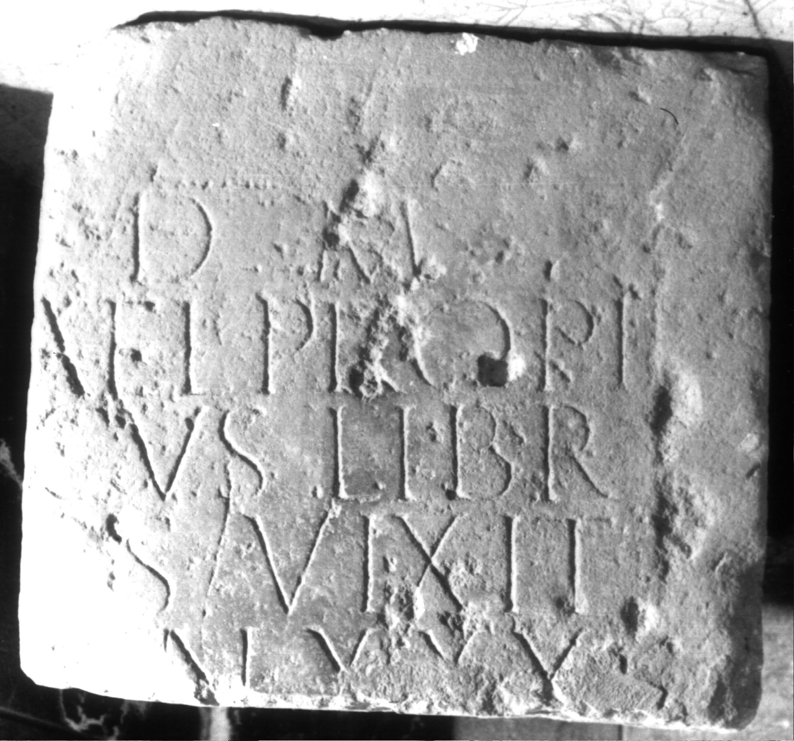

# EDH HD001777. Apulum

**Країна.** Румунія

**Провінція (код EDH).** Dac

**Місце знахідки (антична назва).** Apulum

**Сучасна назва.** Alba Iulia

**Деталі знахідки.** Festung, {S. Michael, katholische Kathedrale}, sekundär verwendet

**Координати.** 46.067648088,23.569900989

**Рік знахідки.** 1961

**Зберігання.** Alba Iulia, Muz. Unirii

**Датування (роки, від'ємні до н. е.).** 168 … 270

**Матеріал.** Sandstein

**Тип пам'ятки.** Tafel

**Розміри (висота, ширина, глибина, см).** -51.0 × -47.0 × 14.0

## Текст (латинь, скорочення розкрито)

```
D(is) M(anibus) / [P(ublius)?] Ael(ius) Propi/[n]cus(!) libr(arius) / [c]o(n)s(ularis) vixit / [an]n(os) XXX / [&
```

## Текст у вихідному записі

```
D M / [ ] AEL PROPI / [ ]CVS LIBR / [ ]OS VIXIT / [ ]N XXX / [
```

## Коментар

Berciu - Popa, Apulum; AE 1965; Berciu - Popa, in: Bibauw (Hrsg.), Hommages; AE 1972 ordnen das Fragment zusammen mit AE 1982, 826b (= AE 1980, 0747 = IDR 3, 5, 624) irrtümlich einer einzigen Inschrift zu. (B): Berciu - Popa, Apulum; AE 1965; Berciu - Popa, in: Bibauw (Hrsg.), Hommages; Forni; AE 1982: Leseabweichungen. Datierung: wegen der Bezeichnung consularis für den Statthalter Dakiens nicht vor 168 n. Chr.

## Література

AE 1982, 0826a. (B)
- G. Forni, ZPE 46, 1982, 190, Nr. 2. (B) - AE 1982.
- AE 1972, 0458.
- I. Berciu - A. Popa, in: J. Bibauw (Hrsg.), Hommages à Marcel Renard 2 (Bruxelles 1969) 78-81, Nr. 3; pl. 6, 3a. (B) - AE 1972.
- AE 1965, 0035. (B)
- I. Berciu - A. Popa, Apulum 5, 1964, 195-197, Nr. 12; fig. 11. (B) - AE 1965.
- C. Ciongradi, Grabmonument und sozialer Status in Oberdakien (Cluj-Napoca 2007) 273, Nr. T/A5; Taf. 125.
- IDR 3, 5, 482; Foto u. Zeichnung. #

## Фото



Джерело https://edh.ub.uni-heidelberg.de/edh/inschrift/HD001777, ліцензія CC BY-SA 4.0. Оригінальний XML в архіві сирі_дані/edh_xml.zip
