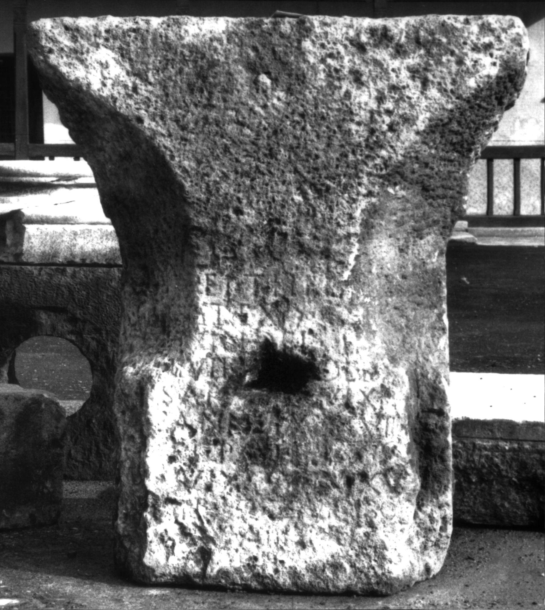
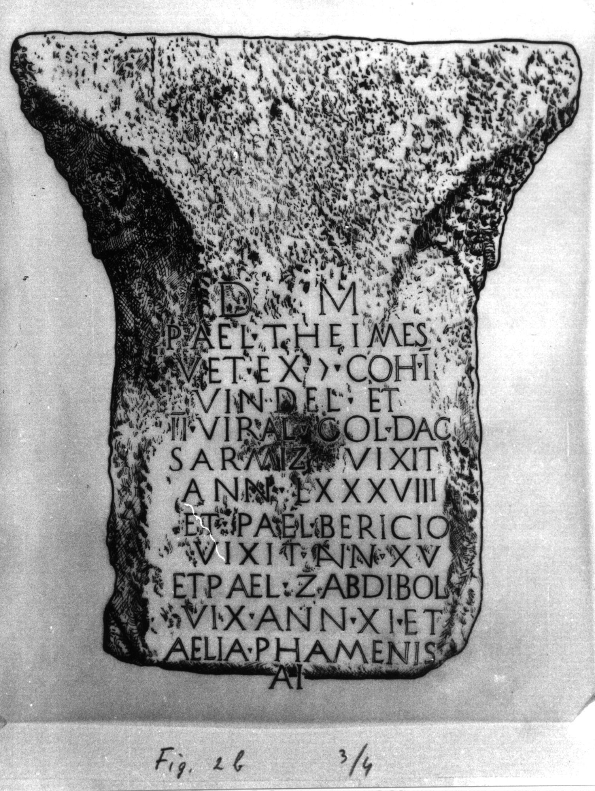
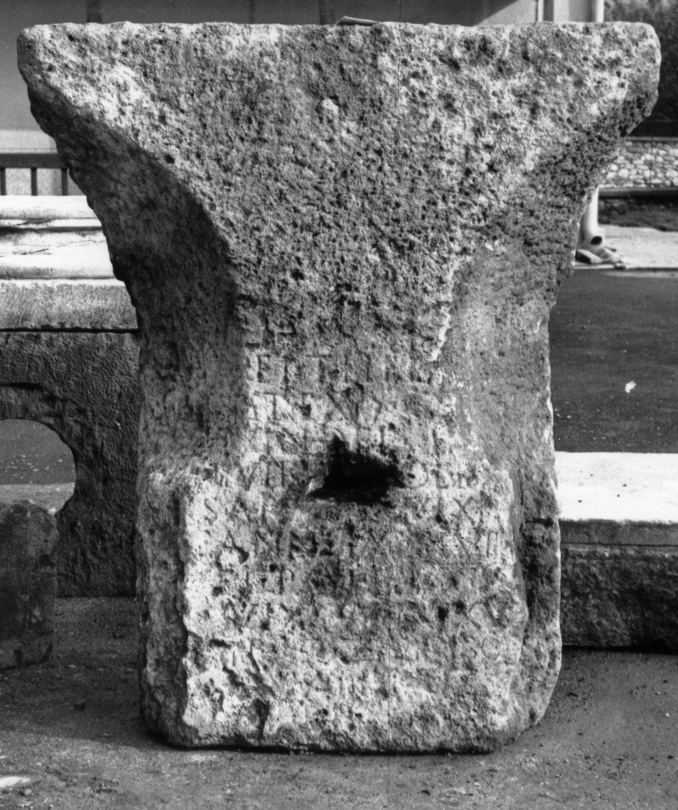

# EDH HD001804. Colonia Ulpia Traiana Sarmizegetusa, aus?

**Країна.** Румунія

**Провінція (код EDH).** Dac

**Місце знахідки (антична назва).** Colonia Ulpia Traiana Sarmizegetusa, aus?

**Сучасна назва.** Sântămăria-Orlea

**Деталі знахідки.** {Schloß Kendeffy}, sekundär verwendet

**Координати.** 45.588916271,22.966584169

**Рік знахідки.** -1889

**Зберігання.** Sarmizegetusa, Muz. Arh.?

**Датування (роки, від'ємні до н. е.).** 151 … 200

**Матеріал.** Kalkstein

**Тип пам'ятки.** Altar

**Розміри (висота, ширина, глибина, см).** -122.0 × 103.0 × 62.0

## Текст (латинь, скорочення розкрито)

```
D(is) M(anibus) / [P(ublius)] Ael(ius) Theim[es] / [v]et(eranus) ex |(centurione) co[h(ortis)] / I Vindel(icorum) et / IIvir[al(is)] col(oniae) Da[c(icae)] / Sarm[iz(egetusae)] vixit / ann(os) LXXXVIII / et P(ublius) Ael(ius) Bericio / vixit ann(os) XV / et P(ublius) Ael(ius) Zabdibol / [vi]x(it) ann(os) XI et / A[el]ia Phame[nis] / [vixit] an[n(os) &
```

## Текст у вихідному записі

```
D M / [ ] AEL THEIM[ ] / [ ]ET EX | CO[ ] / I VINDEL ET / IIVIR[ ] COL DA[ ] / SARM[ ] VIXIT / ANN LXXXVIII / ET P AEL BERICIO / VIXIT ANN XV / ET P AEL ZABDIBOL / [ ]X ANN XI ET / A[ ]IA PHAME[ ] / [ ] AN[
```

## Коментар

(B): CIL: abweichende Textwiedergabe; Ciongradi: Z. 11/12: keine Angabe des Zeilenfalls.

## Література

AE 1982, 0830.
- I. Piso, StudClas 18, 1979, 138-141, Nr. 2; Abb. 2a; Abb. 2b (Zeichnung). - AE 1982.
- CIL 03, 12587. (B)
- IDR 3, 2, 369; fig. 302 (Foto u. Zeichnung).
- C. Ciongradi, Grabmonument und sozialer Status in Oberdakien (Cluj-Napoca 2007) 198, Nr. A/S 1; Taf. 59. (B) #

## Фото







Джерело https://edh.ub.uni-heidelberg.de/edh/inschrift/HD001804, ліцензія CC BY-SA 4.0. Оригінальний XML в архіві сирі_дані/edh_xml.zip
