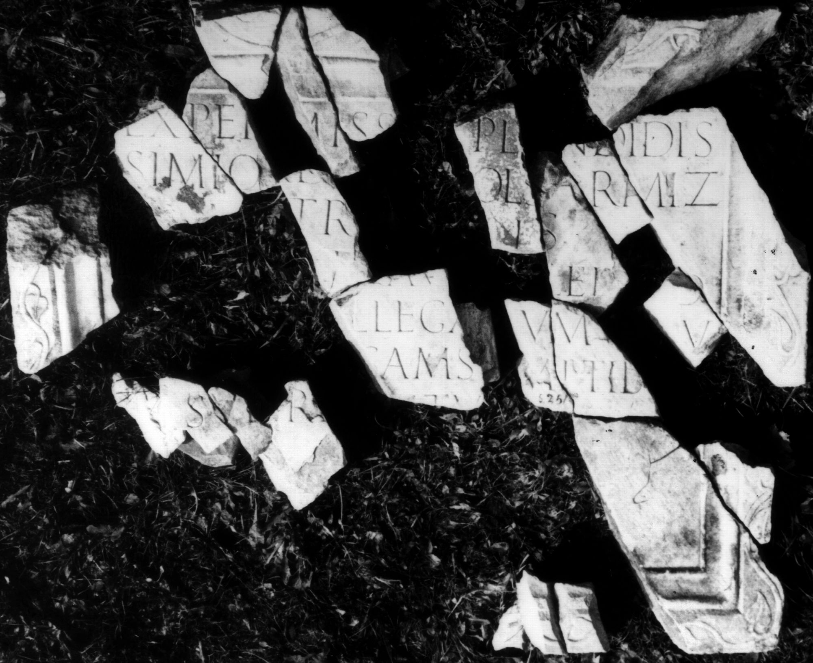

# EDH HD001810. Colonia Ulpia Traiana Sarmizegetusa

**Країна.** Румунія

**Провінція (код EDH).** Dac

**Місце знахідки (антична назва).** Colonia Ulpia Traiana Sarmizegetusa

**Сучасна назва.** Sarmizegetusa

**Деталі знахідки.** Forum Vetus, {Basilica}

**Координати.** 45.513091122,22.787825166

**Рік знахідки.** -1930

**Зберігання.** Sarmizegetusa, Muz. Arh.

**Датування (роки, від'ємні до н. е.).** 222 … 250

**Тип пам'ятки.** Tafel

**Розміри (висота, ширина, глибина, см).** 105.0 × -122.0 × 11.0

## Текст (латинь, скорочення розкрито)

```
Ex permiss[u] spl[e]ndidis/simi ordi[nis c]ol(oniae) Sarmiz(egetusae) / m[e]tr[opo]lis / [---]er Aug(ustalis) [co]l(oniae) eiusd(em) / [aedem co]llegarum v[e]tus/[tate dilap]sam s[u]mptib[us] / suis re[s]titu[it]
```

## Текст у вихідному записі

```
EX PERMISS[ ] SPL[ ]NDIDIS / SIMI ORDI[ ]OL SARMIZ / M[ ]TR[ ]LIS / [ ]ER AVG [ ]L EIVSD / [ ]LLEGARVM V[ ]TVS / [ ]SAM S[ ]MPTIB[ ] / SVIS RE[ ]TITV[ ]
```

## Коментар

23 Fragmente erhalten; Maßangaben rekonstruiert.

## Література

AE 1982, 0832.
- I. Piso, StudClas 18, 1979, 142-144, Nr. 4; Abb. 4 a; Abb. 4 b (Zeichnung). - AE 1982.
- IDR 3, 2, 005; fig. 5 (Zeichnung).
- I. Piso, in: I. Piso (Hrsg.), Le forum vetus de Sarmizegetusa 1 (Bucureşti 2006) 263-265, Nr. 41; Fig. 3, 39 (Foto u. Zeichnung).
- I. Piso, in: HPS 13 (Debrecen 2006) 107. #

## Фото



Джерело https://edh.ub.uni-heidelberg.de/edh/inschrift/HD001810, ліцензія CC BY-SA 4.0. Оригінальний XML в архіві сирі_дані/edh_xml.zip
