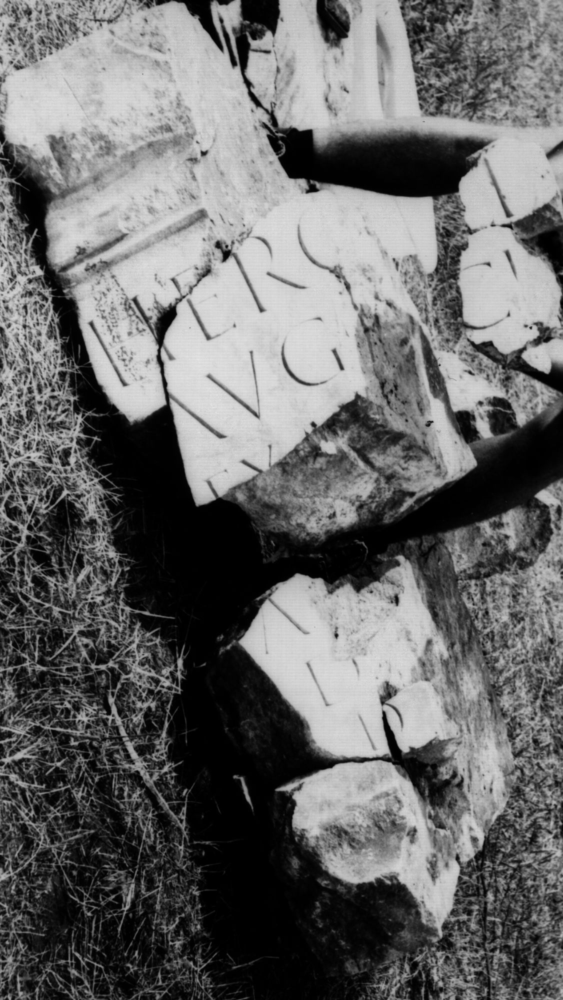

# EDH HD004369. Colonia Ulpia Traiana Sarmizegetusa

**Країна.** Румунія

**Провінція (код EDH).** Dac

**Місце знахідки (антична назва).** Colonia Ulpia Traiana Sarmizegetusa

**Сучасна назва.** Sarmizegetusa

**Деталі знахідки.** {Großer Tempel}

**Координати.** 45.516346737,22.788286722

**Зберігання.** Sarmizegetusa, Muz. Arh.

**Датування (роки, від'ємні до н. е.).** 108 … 170

**Тип пам'ятки.** Statuenbasis

**Розміри (висота, ширина, глибина, см).** -55.5 × -34.5 × -50.0

## Текст (латинь, скорочення розкрито)

```
Herc[u]li / Aug(usto) [sa]cr(um) / [S]ex(tus) At[tius](?) / [------] / A[---] / D[---] / d(onum?) [d(edit)?] // $]V[& // $]O[& // $]DE[& // $] D[&
```

## Текст у вихідному записі

```
HERC[ ]LI / AVG [ ]CR / [ ]EX AT[ ] / [ ] / A[ ] / D[ ] / D [ ] / / ]V[ / / ]O[ / / ]DE[ / / ] D[
```

## Коментар

7, teilweise aneinanderpassende Fragmente erhalten; Maße beziehen sich auf Fragment a; Maße b: (27) x (18) x (26) cm; c: (53) x (26) x (50) cm; d: (6,5) x (3,5) x (15,6) cm; e: (8) x (7) x (12) cm; f: (14) x (10) x (6,5) cm; g: (14) x (12,5) x (4) cm; die Buchstabenhöhe ist bezogen auf alle Fragmente. AE 1978: nicht alle Fragmente wiedergegeben.

## Література

AE 1978, 0673.
- I. Piso, AnInstCluj 21, 1978, 279-280, Nr. 1; fig. 1; fig. 3 (Zeichnung). - AE 1978.
- IDR 3, 2, 221; fig. 177 (Zeichnungen). #

## Фото



Джерело https://edh.ub.uni-heidelberg.de/edh/inschrift/HD004369, ліцензія CC BY-SA 4.0. Оригінальний XML в архіві сирі_дані/edh_xml.zip
