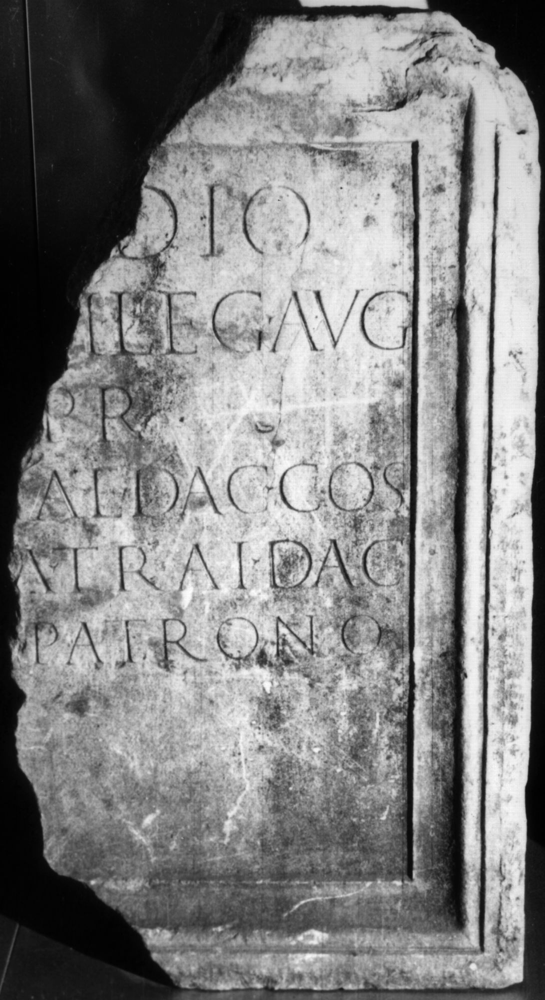
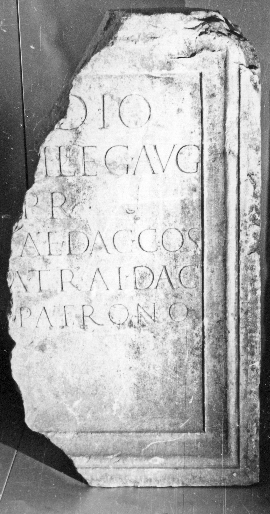

# EDH HD004405. Colonia Ulpia Traiana Sarmizegetusa, aus

**Країна.** Румунія

**Провінція (код EDH).** Dac

**Місце знахідки (антична назва).** Colonia Ulpia Traiana Sarmizegetusa, aus

**Сучасна назва.** Zam

**Деталі знахідки.** {ehemaliges Schloss Nopcsa}

**Координати.** 46.007752922,22.442268133

**Зберігання.** Deva, Muz. Civil. Dac. şi Rom.

**Датування (роки, від'ємні до н. е.).** 148 … 

**Тип пам'ятки.** Tafel

**Розміри (висота, ширина, глибина, см).** 100.0 × -55.0 × 27.0

## Текст (латинь, скорочення розкрито)

```
[P(ublio) Orfi]dio / [Senecion]i leg(ato) Aug(usti) / [pr(o)] pr(aetore) / [provinc]iae Dac(iae) co(n)s(uli) / [col(onia) Ulpi]a Trai(ana) Dac(ica) / [Sarmiz(egetusa)] patrono
```

## Текст у вихідному записі

```
[ ]DIO / [ ]I LEG AVG / [ ] PR / [ ]IAE DAC COS / [ ]A TRAI DAC / [ ] PATRONO
```

## Коментар

Datierung: 148 n. Chr. (Suffektkonsulat des Orfidius Senecio) oder bald danach. (B): CIL III; Piso; AE 1978; IDR III: Leseabweichungen.

## Література

AE 1978, 0672. (B)
- I. Piso, ActaMusNapoca 15, 1978, 182-183, Nr. 2; fig. 3; fig. 4 (Zeichnung). (B) - AE 1978.
- R. Syme, JRS 43, 1953, 160. - AE 1978.
- CIL 03, 01465. (B)
- IDR 3, 2, 101; fig. 80 (Foto u. Zeichnung).
- PIR (2. Aufl.) O 137. #

## Фото





Джерело https://edh.ub.uni-heidelberg.de/edh/inschrift/HD004405, ліцензія CC BY-SA 4.0. Оригінальний XML в архіві сирі_дані/edh_xml.zip
