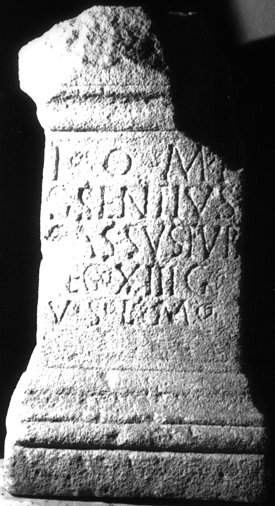

# EDH HD004483. Apulum

**Країна.** Румунія

**Провінція (код EDH).** Dac

**Місце знахідки (антична назва).** Apulum

**Сучасна назва.** Alba Iulia

**Координати.** 46.0669444,23.569999999

**Зберігання.** Alba Iulia, Muz. Unirii

**Датування (роки, від'ємні до н. е.).** 201 … 230

**Матеріал.** Kalkstein

**Тип пам'ятки.** Altar

**Розміри (висота, ширина, глибина, см).** 82.0 × 43.5 × 34.0

## Текст (латинь, скорочення розкрито)

```
I(ovi) O(ptimo) M(aximo) [---] / G(aius) Sentius / Bassus tub(icen) / leg(ionis) XIII g(eminae) / v(otum) s(olvit) l(ibens) m(erito)
```

## Текст у вихідному записі

```
I O M [ ] / G SENTIVS / BASSVS TVB / LEG XIII G / V S L M
```

## Коментар

Z. 1: vom Götterepitheton noch Teil einer senkrechten Haste erhalten. Z. 1, 4, 5: hederae.

## Література

AE 1978, 0664.
- C.L. Băluţă, Apulum 16, 1978, 169-174; fig. 1. - AE 1978.
- IDR 3, 5, 224; Foto. #

## Фото



Джерело https://edh.ub.uni-heidelberg.de/edh/inschrift/HD004483, ліцензія CC BY-SA 4.0. Оригінальний XML в архіві сирі_дані/edh_xml.zip
