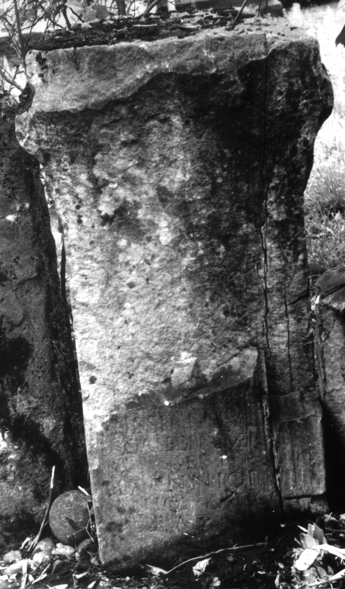
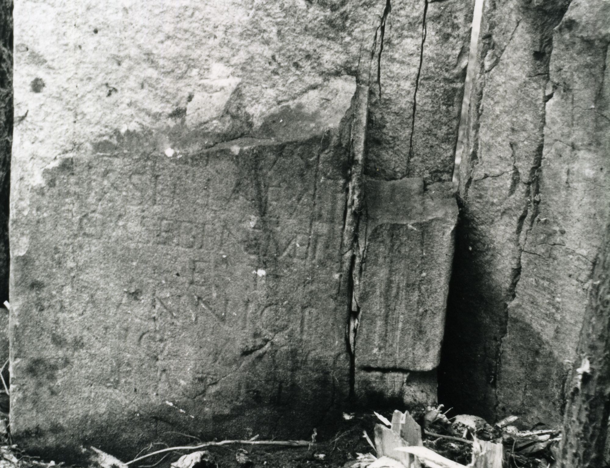

# EDH HD004492. Colonia Ulpia Traiana Sarmizegetusa, aus

**Країна.** Румунія

**Провінція (код EDH).** Dac

**Місце знахідки (антична назва).** Colonia Ulpia Traiana Sarmizegetusa, aus

**Сучасна назва.** Râu de Mori

**Деталі знахідки.** Ostrov, {Pogorârea S. Duh, Kirche}, Umfassungsmauer, sekundär verwendet

**Координати.** 45.527824137,22.846650626

**Зберігання.** Rîu de Mori, Ostrov, Kirche

**Датування (роки, від'ємні до н. е.).** 131 … 250

**Тип пам'ятки.** Altar

**Розміри (висота, ширина, глибина, см).** -105.0 × 60.0 × -40.0

## Текст (латинь, скорочення розкрито)

```
$] / [Ma]crinus c[on(iugi)] / [pi]issimae ad[que](!) / erga se bene mer[enti] / et / Sex(to) Annio Pa[ter?]/nio Aug(ustali) co[l(oniae)] / patri
```

## Текст у вихідному записі

```
] / [ ]CRINVS C[ ] / [ ]ISSIMAE AD[ ] / ERGA SE BENE MER[ ] / ET / SEX ANNIO PA[ ] / NIO AVG CO[ ] / PATRI
```

## Коментар

(B): Piso; AE 1978; IDR III 2: kleinere Abweichungen in der Lesung.

## Література

AE 1978, 0670. (B)
- I. Piso, Apulum 16, 1978, 191-192, Nr. 2; fig. 2a; fig. 2b (Zeichnung). (B) - AE 1978.
- IDR 3, 2, 374; fig. 305 (Foto u. Zeichnung). (B) #

## Фото





Джерело https://edh.ub.uni-heidelberg.de/edh/inschrift/HD004492, ліцензія CC BY-SA 4.0. Оригінальний XML в архіві сирі_дані/edh_xml.zip
