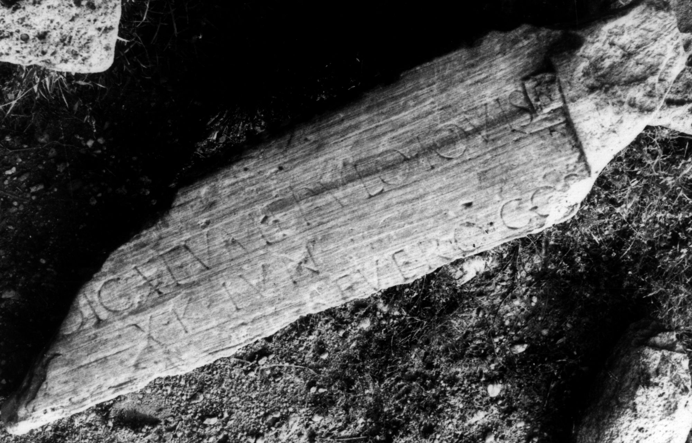

# EDH HD004759. Colonia Ulpia Traiana Sarmizegetusa, aus?

**Країна.** Румунія

**Провінція (код EDH).** Dac

**Місце знахідки (антична назва).** Colonia Ulpia Traiana Sarmizegetusa, aus?

**Сучасна назва.** Sarmizegetusa

**Деталі знахідки.** Breazova, {S. Toma, Kirche}

**Координати.** 45.529134537,22.792733609

**Зберігання.** Sarmizegetusa, Muz. Arh.

**Датування (роки, від'ємні до н. е.).** 151 … 200

**Тип пам'ятки.** Tafel

**Розміри (висота, ширина, глибина, см).** -42.0 × -120.0 × 17.0

## Текст (латинь, скорочення розкрито)

```
[De]dicatum epulo Iovis / X K(alendas) Iun(ias) / [Av]iola et Severo co(n)s(ulibus)
```

## Текст у вихідному записі

```
[ ]DICATVM EPVLO IOVIS / X K IVN / [ ]IOLA ET SEVERO COS
```

## Коментар

(B): Wollmann; Piso; AE 1978: Abweichungen in Lesung / Ergänzung. Der 23. 5. ist nach Piso vielleicht der Jahrestag der Weihung des Kapitols von Sarmizegetusa. Datierung: Es handelt sich um ein bisher unbekanntes Paar von Suffektkonsuln gegen Mitte des 2. Jh. oder um 180.

## Література

AE 1978, 0666. (B)
- I. Piso, ActaMusNapoca 15, 1978, 179-182, Nr. 1; fig. 1; fig. 2 (Zeichnung). (B) - AE 1978.
- V. Wollmann, Apulum 13, 1975, 222-224, Nr. 23; fig. 25a; fig. 25b (Zeichnung). (B) - AE 1978.
- IDR 3, 2, 242; fig. 196 (Foto u. Zeichnung). #

## Фото



Джерело https://edh.ub.uni-heidelberg.de/edh/inschrift/HD004759, ліцензія CC BY-SA 4.0. Оригінальний XML в архіві сирі_дані/edh_xml.zip
