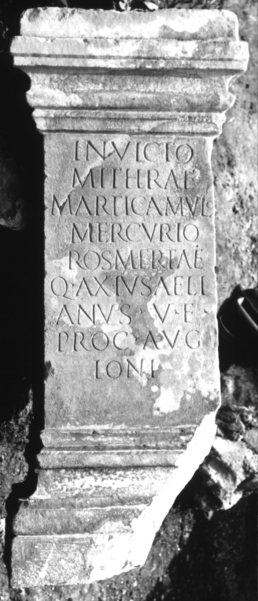

# EDH HD004897. Colonia Ulpia Traiana Sarmizegetusa

**Країна.** Румунія

**Провінція (код EDH).** Dac

**Місце знахідки (антична назва).** Colonia Ulpia Traiana Sarmizegetusa

**Сучасна назва.** Sarmizegetusa

**Деталі знахідки.** Praetorium procuratoris, {area sacra}

**Координати.** 45.515134153,22.787739334

**Зберігання.** Sarmizegetusa, Muz. Arh.

**Датування (роки, від'ємні до н. е.).** 235 … 238

**Тип пам'ятки.** Statuenbasis

**Розміри (висота, ширина, глибина, см).** 141.0 × 43.0 × 37.0

## Текст (латинь, скорочення розкрито)

```
Invicto / Mithrae / Marti Camulo / Mercurio / Rosmertae / Q(uintus) Axius Aeli/anus v(ir) e(gregius) / proc(urator) Aug[[g(ustorum)]] / Ioni
```

## Текст у вихідному записі

```
INVICTO / MITHRAE / MARTI CAMVLO / MERCVRIO / ROSMERTAE / Q AXIVS AELI / ANVS V E / PROC AVG[[G]] / IONI
```

## Коментар

Altar oder Statuenbasis.

## Література

AE 1998, 1100.
- ILD 277.
- PIR (2. Aufl.) A 1688.
- I. Piso, ZPE 120, 1998, 264-265, Nr. 13; Foto. - AE 1998. #

## Фото



Джерело https://edh.ub.uni-heidelberg.de/edh/inschrift/HD004897, ліцензія CC BY-SA 4.0. Оригінальний XML в архіві сирі_дані/edh_xml.zip
