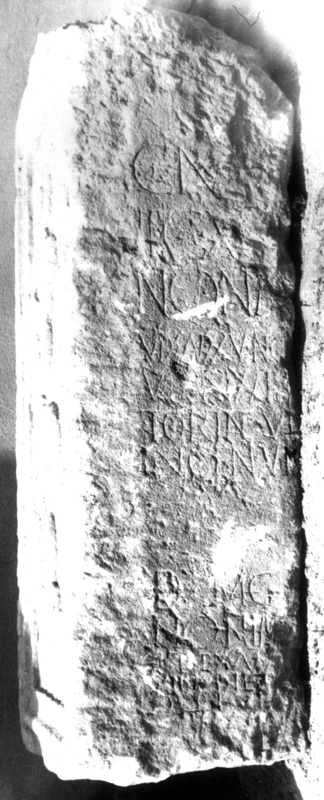

# EDH HD005794. Apulum

**Країна.** Румунія

**Провінція (код EDH).** Dac

**Місце знахідки (антична назва).** Apulum

**Сучасна назва.** Alba Iulia

**Деталі знахідки.** Festung, {S. Michael, katholische Kathedrale}

**Координати.** 46.067648088,23.569900989

**Рік знахідки.** 1970

**Зберігання.** Alba Iulia, Muz. Unirii

**Датування (роки, від'ємні до н. е.).** 107 … 270

**Матеріал.** Kalkstein

**Тип пам'ятки.** Altar

**Розміри (висота, ширина, глибина, см).** -145.0 × -46.0 × -69.0

## Текст (латинь, скорочення розкрито)

```
C(aio) N[onio? ---] / leg(ionis) XI[II g(eminae) ---] / Non[io ---] / vix(it) an(nis) XXV No[n(io?) ---] / vix(it) an(nis) XXIII [--- Vic]/torin(a)e vi[x(it) an(nis) ---] / Ingen(u)i vi[x(it) an(nis) ---] / D MG [---] / Non(ius) Im[---] / [ve?]t(eranus)(?) ex [--- leg(ionis)] / XIII g(eminae) ne[potibus?] / [&
```

## Текст у вихідному записі

```
C N[ ] / LEG XI[ ] / NON[ ] / VIX AN XXV NO[ ] / VIX AN XXIII [ ] / TORINE VI[ ] / INGENI VI[ ] / D MG [ ] / NON IM[ ] / [ ]T EX [ ] / XIII G NE[ ] / [
```

## Коментар

Linker Teil einer Basis, bearbeitet und als Baustein wiederverwendet. Linke seite der Basis mit Weintraubenmotiven dekoriert. (B): Russu; AE 1980: mehrere Abweichungen. Z. 10: alternative Lesung: [2]LEXA[3].

## Література

AE 1980, 0743. (B)
- I.I. Russu, RevMuz 17, 9, 1980, 39-40, Nr. 8; fig. 8 (2 Fotos, 1 Zeichnung). - AE 1980. (B)
- AE 1987, 0833.
- IDR 3, 5, 561; Foto u. Zeichnung.
- C. Ciongradi, Grabmonument und sozialer Status in Oberdakien (Cluj-Napoca 2007) 232-233, Nr. Sc/A 10; Taf. 88. #

## Фото



Джерело https://edh.ub.uni-heidelberg.de/edh/inschrift/HD005794, ліцензія CC BY-SA 4.0. Оригінальний XML в архіві сирі_дані/edh_xml.zip
