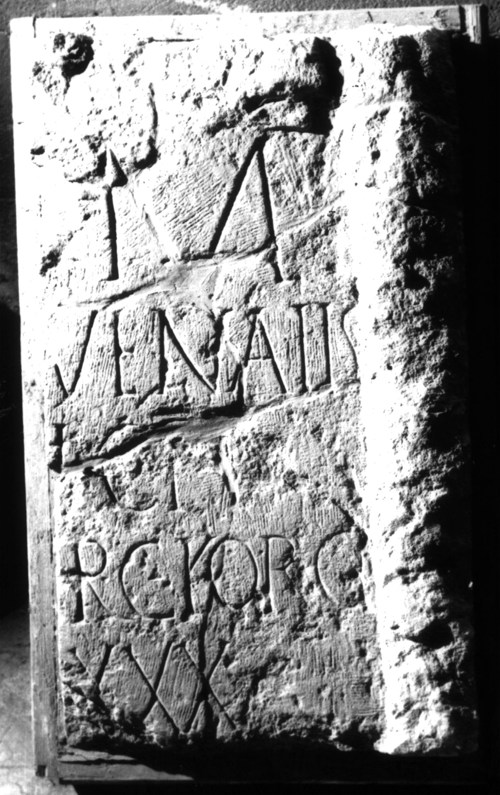
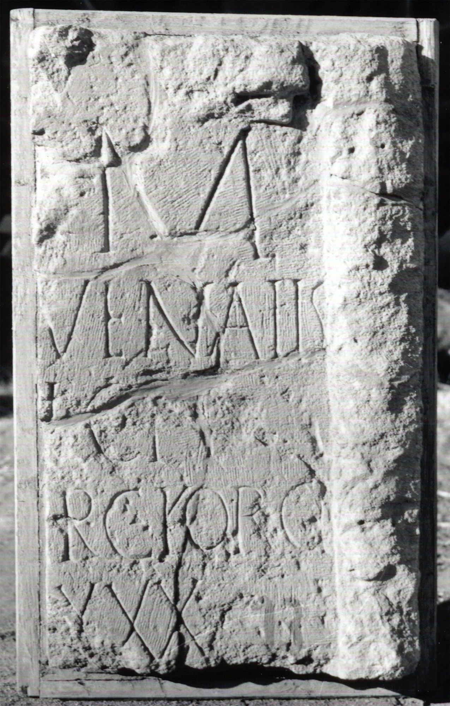

# EDH HD005797. Apulum

**Країна.** Румунія

**Провінція (код EDH).** Dac

**Місце знахідки (антична назва).** Apulum

**Сучасна назва.** Alba Iulia

**Деталі знахідки.** Festung, {S. Michael, katholische Kathedrale}

**Координати.** 46.067648088,23.569900989

**Зберігання.** Alba Iulia, Muz. Unirii

**Датування (роки, від'ємні до н. е.).** 107 … 200

**Матеріал.** Gesteine

**Тип пам'ятки.** Stele

**Розміри (висота, ширина, глибина, см).** -57.0 × -40.0 × 20.0

## Текст (латинь, скорочення розкрито)

```
[D(is)] M(anibus) / [--- Iu]venalis / [---]ICIV / [---]R C(?) For(o) Cl(audi) / [vixit ann(is)] XXX / [&
```

## Текст у вихідному записі

```
[ ] M / [ ]VENALIS / [ ]ICIV / [ ]R C FOR CL / [ ] XXX / [
```

## Коментар

Rechter Teil einer Stele. Inschriftfeld ursprünglich von zwei tordierten Halbsäulen flankiert, davon heute noch eine erkennbar. (B): Russu: AE 1980: Z. 3-5: [---]i co(n)iu(x?) / [---]R c(ivis?) Foro C/ [--- ann(is)] XXXV.

## Література

AE 1980, 0744. (B)
- I.I. Russu, RevMuz 17, 9, 1980, 40-41, Nr. 9; fig. 9 (Foto u. Zeichnung). - AE 1980. (B).
- IDR 3, 5, 549; Foto u. Zeichnung. #

## Фото





Джерело https://edh.ub.uni-heidelberg.de/edh/inschrift/HD005797, ліцензія CC BY-SA 4.0. Оригінальний XML в архіві сирі_дані/edh_xml.zip
