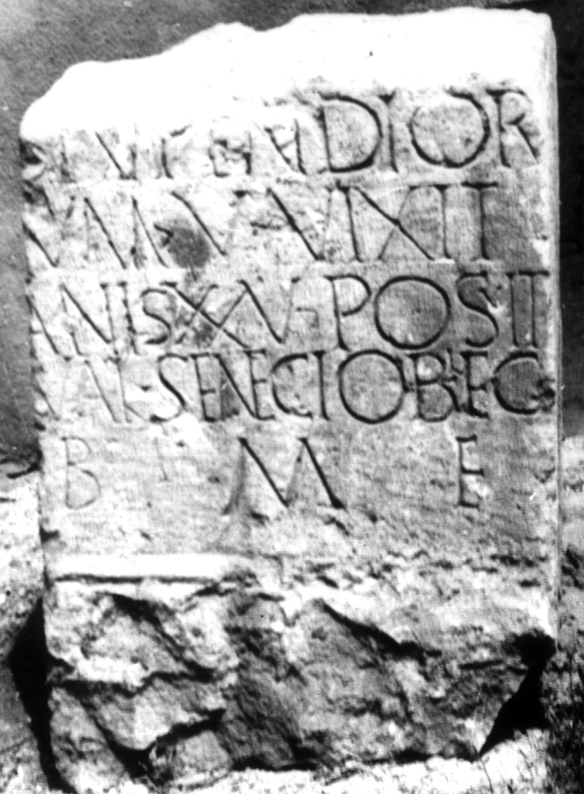
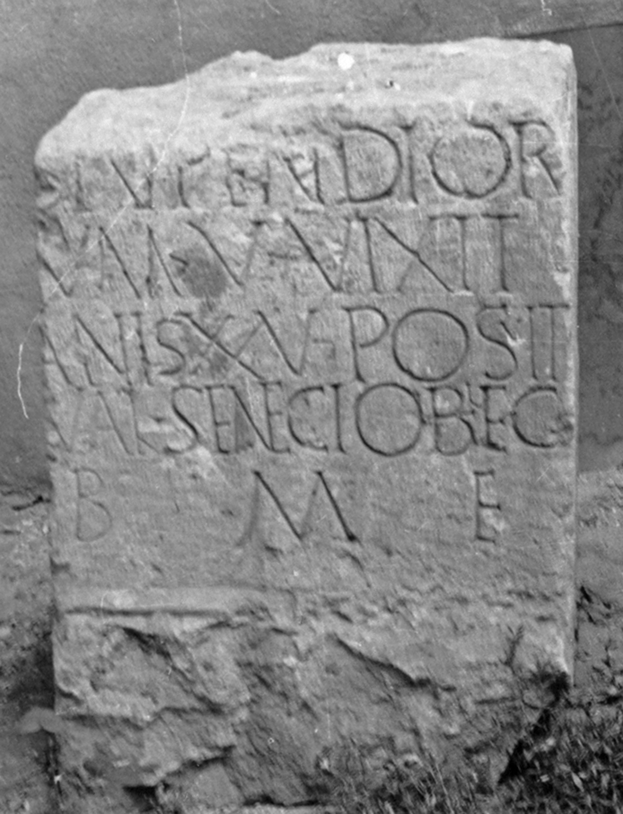

# EDH HD005803. Apulum

**Країна.** Румунія

**Провінція (код EDH).** Dac

**Місце знахідки (антична назва).** Apulum

**Сучасна назва.** Alba Iulia

**Деталі знахідки.** Festung, {S. Michael, katholische Kathedrale}

**Координати.** 46.067648088,23.569900989

**Зберігання.** Alba Iulia, Muz. Unirii

**Датування (роки, від'ємні до н. е.).** 168 … 300

**Матеріал.** Sandstein

**Тип пам'ятки.** Basis

**Розміри (висота, ширина, глибина, см).** -70.0 × -48.0 × -43.0

## Текст (латинь, скорочення розкрито)

```
$] / stupendior/um(!) V vixit / an(n)is XXV posuit / Val(erius) Senecio b(ene)f(iciarius) leg(ati) / b(ene) m(erenti) f(ecit)
```

## Текст у вихідному записі

```
] / STVPENDIOR / VM V VIXIT / ANIS XXV POSVIT / VAL SENECIO BF LEG / B M F
```

## Коментар

Basis in späterer Zeit bearbeitet und als Baustein wiederverwendet.

## Література

AE 1980, 0746.
- I.I. Russu, RevMuz 17, 9, 1980, 41-42, Nr. 11; fig. 11 (Foto u. Zeichnung). - AE 1980.
- IDR 3, 5, 590; Foto u. Zeichnung. #

## Фото





Джерело https://edh.ub.uni-heidelberg.de/edh/inschrift/HD005803, ліцензія CC BY-SA 4.0. Оригінальний XML в архіві сирі_дані/edh_xml.zip
