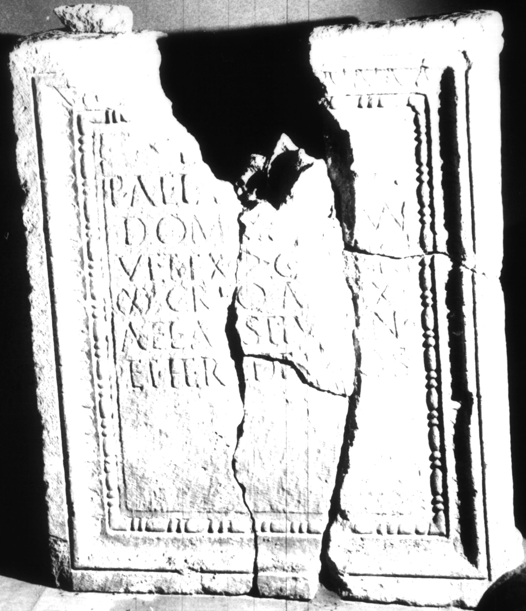

# EDH HD005818. Apulum

**Країна.** Румунія

**Провінція (код EDH).** Dac

**Місце знахідки (антична назва).** Apulum

**Сучасна назва.** Alba Iulia

**Деталі знахідки.** {Partoş}

**Координати.** 46.0463184,23.566650100

**Зберігання.** Alba Iulia, Muz. Unirii

**Датування (роки, від'ємні до н. е.).** 117 … 200

**Матеріал.** Kalkstein

**Тип пам'ятки.** Altar

**Розміри (висота, ширина, глибина, см).** 110.0 × 91.0 × 46.5

## Текст (латинь, скорочення розкрито)

```
D(is) M(anibus) / P(ublio) Ael(io) Tertio / dom(o) Cl(audia) Virun(o) / vet(erano) ex |(centurione) coh(ortis) I Brit(annicae) / |(miliariae) c(ivium) R(omanorum) eq(uitatae) an[n(orum)] LX / Ael(ia) A[e]stiv[a] con(iunx) / et heredes pos(uerunt)
```

## Текст у вихідному записі

```
D M / P AEL TERTIO / DOM CL VIRVN / VET EX | COH I BRIT / | C R EQ AN[ ] LX / AEL A[ ]STIV[ ] CON / ET HEREDES POS
```

## Коментар

Altar in späterer Zeit bearbeitet und als Sarkophag wiederverwendet. Inschrift ursprünglich in zehn Fragmente gebrochen. Ein Fragment des oberen Teils heute nicht erhalten. (B): Z. 7: Russu; AE 1980: her(es) de s(uo) pos(uit); Ciongradi: heres pos(uerunt).

## Література

AE 1944, 0034.
- C. Daicoviciu, Dacia 7/8, 1937-1940, 307-308, Nr. 9. - AE 1944.
- AE 1980, 0751. (B)
- I.I. Russu, RevMuz 17, 9, 1980, Nr. 16; fig. 16 (Zeichnung). - AE 1980. (B)
- IDR 3, 5, 484; Foto u. Zeichnung.
- AE 2004, 1181.
- E. Weber, in: L. Ruscu - C. Ciongradi - R. Ardevan - C. Roman - C. Găzdac (Hrsg.), Orbis Antiquus. Studia in honorem Ioannis Pisonis (Cluj-Napoca 2004) 819. - AE 2004.
- C. Ciongradi, Grabmonument und sozialer Status in Oberdakien (Cluj-Napoca 2007) 235, Nr. Sc/A 17; Taf. 92. (B) #

## Фото



Джерело https://edh.ub.uni-heidelberg.de/edh/inschrift/HD005818, ліцензія CC BY-SA 4.0. Оригінальний XML в архіві сирі_дані/edh_xml.zip
