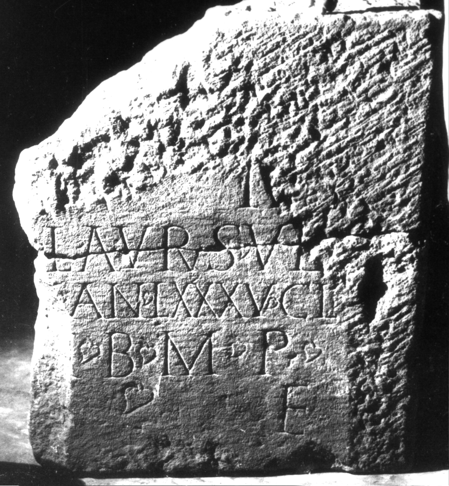

# EDH HD005821. Apulum

**Країна.** Румунія

**Провінція (код EDH).** Dac

**Місце знахідки (антична назва).** Apulum

**Сучасна назва.** Alba Iulia

**Координати.** 46.0669444,23.569999999

**Зберігання.** Alba Iulia, Muz. Unirii

**Датування (роки, від'ємні до н. е.).** 151 … 230

**Матеріал.** Kalkstein

**Тип пам'ятки.** Stele

**Розміри (висота, ширина, глибина, см).** -69.0 × -58.0 × 17.0

## Текст (латинь, скорочення розкрито)

```
[D(is)] M(anibus) / [---] Laurus ve[t(eranus)] / [leg(ionis) XIII gem(inae) vix(it)] an(nos) LXXXV Cl(laudia) / [--- coniugi?] b(ene) m(erenti) p(osuit) / [h(ic) s(itus)] e(st)
```

## Текст у вихідному записі

```
[ ] M / [ ] LAVRVS VE[ ] / [ ] AN LXXXV CL / [ ] B M P / [ ] E
```

## Коментар

Stele zum Teil in späterer Zeit bearbeitet und als Baustein wiederverwendet. Z. 3-5: hederae. (B): Radu: Z. 3: vix(it) an(nos); AE 1980: Z. 3: ann(os).

## Література

AE 1980, 0752. (B)
- IDR 3, 5, 550; Foto u. Zeichnung.
- D. Radu, Apulum 4, 1961, 109, Nr. 20; fig. 20. (B) - AE 1980.
- I.I. Russu, RevMuz 17, 9, 1980, 45-46, Nr. 17; fig. 17 (Foto u. Zeichnung). - AE 1980.
- C.C. Petolescu, StCercIstorV 33, 1982, 122, Nr. 4.
- C. Ciongradi, Grabmonument und sozialer Status in Oberdakien (Cluj-Napoca 2007) 187, Nr. S/A 101. #

## Фото



Джерело https://edh.ub.uni-heidelberg.de/edh/inschrift/HD005821, ліцензія CC BY-SA 4.0. Оригінальний XML в архіві сирі_дані/edh_xml.zip
