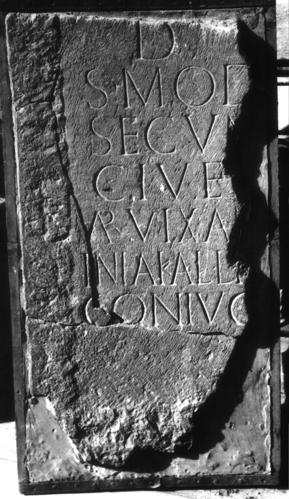

# EDH HD005824. Apulum

**Країна.** Румунія

**Провінція (код EDH).** Dac

**Місце знахідки (антична назва).** Apulum

**Сучасна назва.** Alba Iulia

**Деталі знахідки.** Festung, {S. Michael, katholische Kathedrale}

**Координати.** 46.067648088,23.569900989

**Рік знахідки.** 1910

**Зберігання.** Alba Iulia, Muz. Unirii

**Датування (роки, від'ємні до н. е.).** 107 … 200

**Матеріал.** Kalkstein

**Тип пам'ятки.** Stele

**Розміри (висота, ширина, глибина, см).** -81.0 × -43.0 × 15.0

## Текст (латинь, скорочення розкрито)

```
D(is) [M(anibus)] / S(extus?) Mod[estius] / Secun[dinus] / cives [---]/AR(---) vix(it) an(nis) [---]/inia Kalli[---] / coniug[i b(ene) m(erenti) p(osuit)]
```

## Текст у вихідному записі

```
D [ ] / S MOD[ ] / SECVN[ ] / CIVES [ ] / AR VIX AN [ ] / INIA KALLI[ ] / CONIVG[ ]
```

## Коментар

Unterer linker Teil einer Stele; in späterer Zeit bearbeitet und als Baustein wiederverwendet. Z. 2: S. S(extus) oder S(purius) möglich.

## Література

AE 1980, 0753.
- I.I. Russu, RevMuz 17, 9, 1980, 46, Nr. 18; fig. 18 (Foto u. Zeichnung). - AE 1980.
- C. Ciongradi, Grabmonument und sozialer Status in Oberdakien (Cluj-Napoca 2007) 187, Nr. S/A 102; Taf. 58.
- IDR 3, 5, 557; Foto u. Zeichnung. #

## Фото



Джерело https://edh.ub.uni-heidelberg.de/edh/inschrift/HD005824, ліцензія CC BY-SA 4.0. Оригінальний XML в архіві сирі_дані/edh_xml.zip
