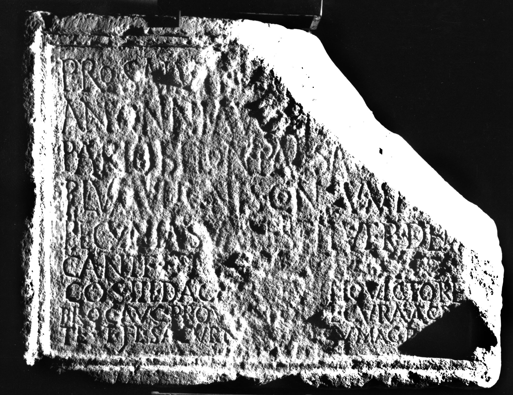
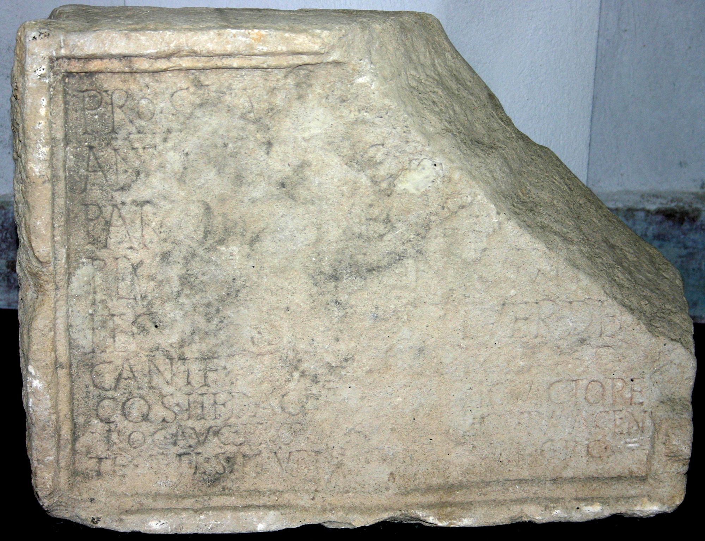
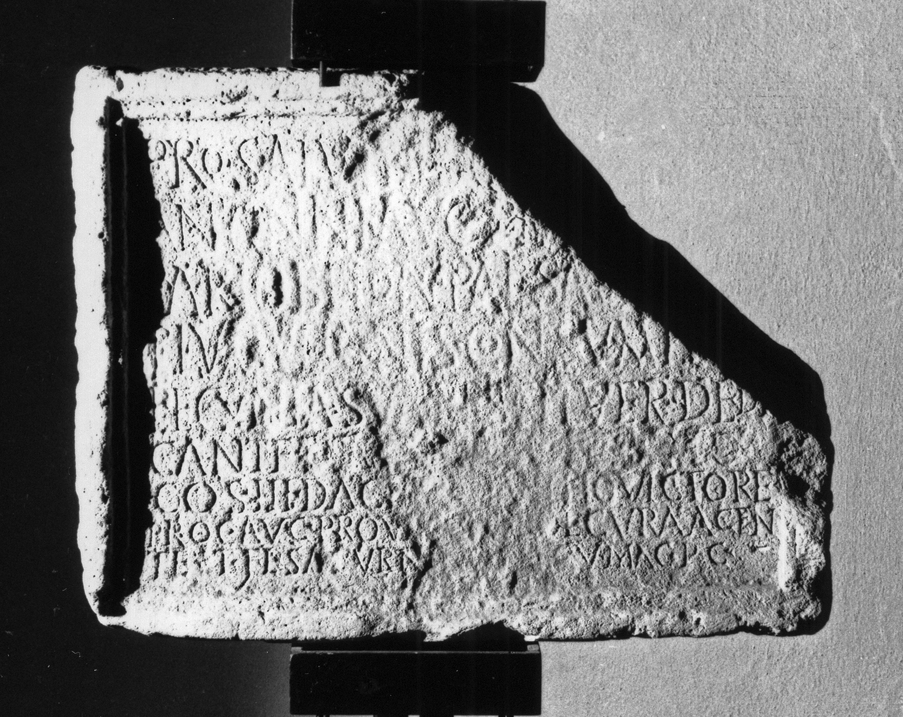

# EDH HD005830. Porolissum

**Країна.** Румунія

**Провінція (код EDH).** Dac

**Місце знахідки (антична назва).** Porolissum

**Сучасна назва.** Creaca

**Деталі знахідки.** Jac, {Lager}, nördlich

**Координати.** 47.180430173,23.158589600

**Рік знахідки.** 1939

**Зберігання.** Zalău, Muz. Ist. Artă

**Датування (роки, від'ємні до н. е.).** 215 … 217

**Матеріал.** Kalkstein

**Тип пам'ятки.** Tafel

**Розміри (висота, ширина, глибина, см).** 45.0 × 60.0 × 15.0

## Текст (латинь, скорочення розкрито)

```
Pro salute [I]m[p(eratoris) M(arci) Aureli] / Antonini Aug(usti) Pii [Fel(icis) deo] / patrio Belo n(umerus) Pal(myrenorum) sag[it(tariorum) tem]/plum vi ignis consump[tum] / pecunia sua restituer(unt) dedi/cant<e=F>#dedi/cant<e>#DEDICANTF [[[C(aio)] I[ul(io) Sept(imio) Casti]no]] / co(n)s(ulari) III Daci[ar(um) M(arco)?] Ulpio Victore / proc(uratore) Aug(usti) provi[nc(iae) Por]ol(issensis) cura(m) agen/te T(ito) Fl(avio) Saturn[ino |(centurione) le]g(ionis) V Mac(edonicae) p(iae) c(onstantis)
```

## Текст у вихідному записі

```
PRO SALVTE [ ]M[ ] / ANTONINI AVG PII [ ] / PATRIO BELO N PAL SAG[ ] / PLVM VI IGNIS CONSVMP[ ] / PECVNIA SVA RESTITVER DEDI / CANTF [[[ ] I[ ]NO]] / COS III DACI[ ] VLPIO VICTORE / PROC AVG PROVI[ ]OL CVRA AGEN / TE T FL SATVRN[ ]G V MAC P C
```

## Коментар

2 Fragmente, von denen eines (rechte obere Ecke mit den Enden von Z. 1-4) inzwischen verloren ist. (B): Gudea - Lucăcel; AE 1980; ILD: Leseabweichungen.

## Література

AE 1980, 0755. (B)
- ILD 663. (B)
- I. Piso, ZPE 40, 1980, 277-282; Taf. 18e; Zeichnung. - AE 1980.
- PIR (2. Aufl.) I 566.
- N. Gudea - V. Lucăcel, Inscripţii şi monumente sculpturale în Muzeul de Istorie şi Artă Zalău (Zalău 1975) 11-12, Nr. 7; Foto. (B) #

## Фото







Джерело https://edh.ub.uni-heidelberg.de/edh/inschrift/HD005830, ліцензія CC BY-SA 4.0. Оригінальний XML в архіві сирі_дані/edh_xml.zip
