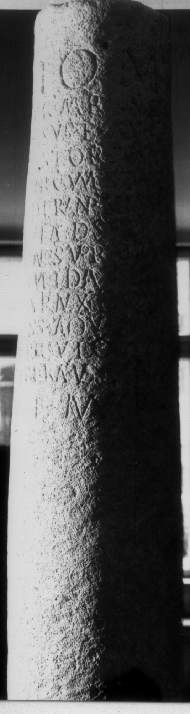
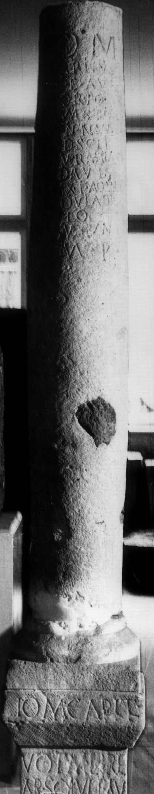
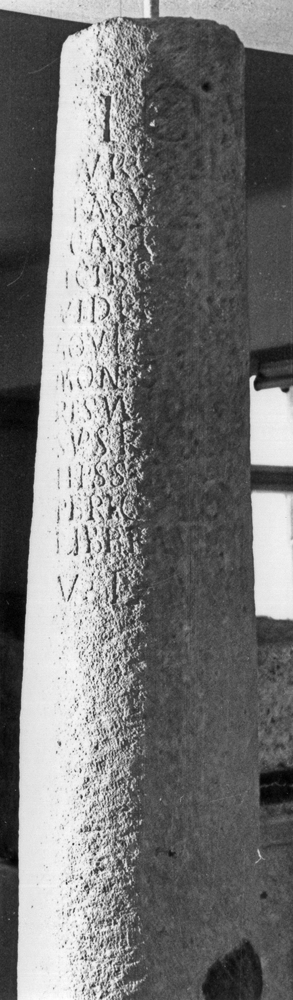
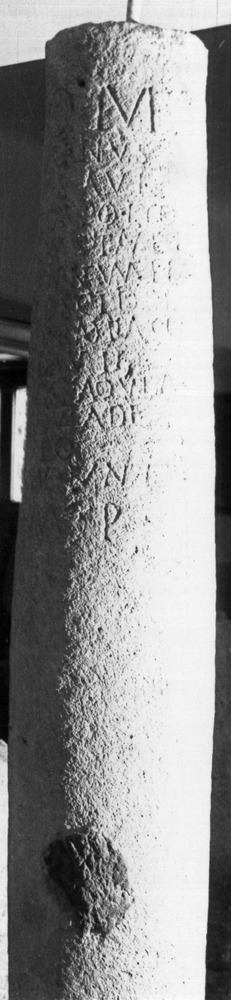

# EDH HD006063. Apulum

**Країна.** Румунія

**Провінція (код EDH).** Dac

**Місце знахідки (антична назва).** Apulum

**Сучасна назва.** Alba Iulia

**Деталі знахідки.** {Partoş}

**Координати.** 46.0463184,23.566650100

**Зберігання.** Cluj-Napoca, Muz. Naţ. Ist. Transilv.

**Датування (роки, від'ємні до н. е.).** 201 … 275

**Матеріал.** Kalkstein

**Тип пам'ятки.** EhrenVotivsäule

**Розміри (висота, ширина, глибина, см).** -155.0 × 26.0

## Текст (латинь, скорочення розкрито)

```
I(ovi) O(ptimo) M(aximo) / Aur(elius) Marinus / Bas(s)us et Aur(elius) / Castor Polyd/i circumstantes / viderunt numen / aquilae descidis(s)e / monte supra dracone(m) / res validavit / supstrinxit(!) aquila(m) / hi s(upra) s(cripti) aquila(m) de / periculo / liberaverunt / v(oto) l(ibentes) m(erito) p(osuerunt)
```

## Текст у вихідному записі

```
I O M / AVR MARINVS / BASVS ET AVR / CASTOR POLYD / I CIRCVMSTANTES / VIDERVNT NVMEN / AQVILAE DESCIDISE / MONTE SVPRA DRACONE / RES VALIDAVIT / SVPSTRINXIT AQVILA / HI S S AQVILA DE / PERICVLO / LIBERAVERVNT / V L M P
```

## Коментар

(B): CIL III: Z. 2: Martinus; Z. 4-5: po(ntem?); Z. 9: tres. Valida viipe(ra) o. tres valida vii.

## Література

AE 1980, 0734.
- I. Piso, ActaMusNapoca 17, 1980, 81-84, Nr. 1; fig. 1a (Foto); fig. 1b (Zeichnung). - AE 1980.
- CIL 03, 07756. (B)
- IDR 3, 5, 136; Foto u. Zeichnung. #

## Фото









Джерело https://edh.ub.uni-heidelberg.de/edh/inschrift/HD006063, ліцензія CC BY-SA 4.0. Оригінальний XML в архіві сирі_дані/edh_xml.zip
